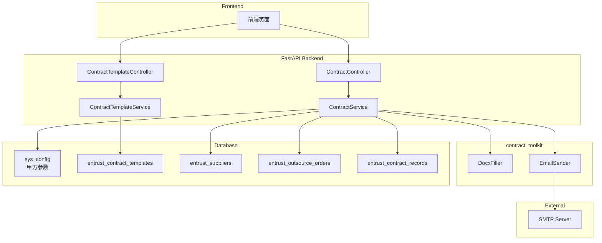
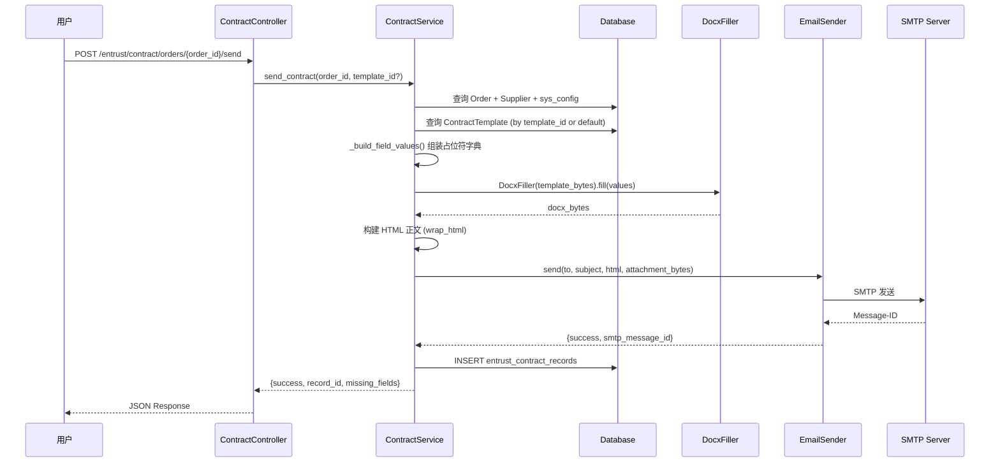

# Design Document: Contract Dispatch (合同分发)

## Overview

本设计将合同分发功能集成到现有 `module_entrust` 模块中，实现从数据库自动填充 DOCX 合同模板、通过 SMTP 邮件发送给供应商、以及记录发送历史的完整流程。

系统复用已有的 `contract_toolkit`（`DocxFiller` + `EmailSender`）工具包，新增合同模板管理 CRUD、基于订单的合同发送 API、以及合同预览/下载能力。

### 设计目标

1. **模板管理**：支持多模板上传、软删除、分类筛选
2. **自动填充**：从 `sys_config`（甲方）+ `EntrustSupplier`（乙方）+ `EntrustOutsourceOrder`（订单）自动组装字段
3. **邮件发送**：填充后直接通过 SMTP 发送，附件为 DOCX 字节流（不落盘）
4. **历史追踪**：每次发送独立记录，支持重发、按订单查询
5. **环境隔离**：SMTP 配置通过环境变量管理，DEBUG 模式跳过实际发送

---

## Architecture



### 请求流程（发送合同）



---

## Components and Interfaces

### 1. ContractTemplateController (`/entrust/contract/templates`)

| Method | Path | 描述 |
|--------|------|------|
| POST | `/entrust/contract/templates` | 上传新模板（multipart/form-data） |
| GET | `/entrust/contract/templates` | 获取所有启用模板列表 |
| DELETE | `/entrust/contract/templates/{template_id}` | 软删除模板 |

### 2. ContractController (`/entrust/contract/orders`)

| Method | Path | 描述 |
|--------|------|------|
| POST | `/entrust/contract/orders/{order_id}/send` | 填充并发送合同 |
| GET | `/entrust/contract/orders/{order_id}/preview` | 预览/下载填充后 DOCX |
| GET | `/entrust/contract/records` | 查询发送历史记录 |

### 3. ContractTemplateService

```python
class ContractTemplateService:
    @staticmethod
    async def upload_template(db, file: UploadFile, name: str, category: str | None) -> dict
    
    @staticmethod
    async def list_active_templates(db) -> list[dict]
    
    @staticmethod
    async def soft_delete_template(db, template_id: int) -> bool
    
    @staticmethod
    async def get_template_by_id(db, template_id: int) -> EntrustContractTemplate | None
    
    @staticmethod
    async def get_default_template(db) -> EntrustContractTemplate | None
```

### 4. ContractService（重构现有）

```python
class ContractService:
    @staticmethod
    async def send_contract_by_order(
        db: AsyncSession,
        order_id: int,
        template_id: int | None = None,
        created_by: int = 0,
    ) -> dict:
        """基于订单发送合同，返回 {success, record_id, missing_fields}"""
    
    @staticmethod
    async def preview_contract_by_order(
        db: AsyncSession,
        order_id: int,
        template_id: int | None = None,
    ) -> tuple[bytes, str]:
        """预览合同，返回 (docx_bytes, filename)"""
    
    @staticmethod
    async def get_records_by_order(db, order_id: int) -> list[dict]:
        """获取订单的发送历史"""
    
    @staticmethod
    def build_field_values(
        order: EntrustOutsourceOrder,
        supplier: EntrustSupplier,
        party_a_config: dict[str, str],
    ) -> tuple[dict[str, str], list[str]]:
        """纯函数：组装占位符字典，返回 (values, missing_fields)"""
    
    @staticmethod
    def build_attachment_filename(supplier_name: str, order_no: str) -> str:
        """纯函数：生成附件文件名"""
    
    @staticmethod
    def build_email_html(
        sender: EmailSender,
        order_no: str,
        supplier_name: str,
        amount: str,
        delivery_date: str,
    ) -> str:
        """纯函数：生成邮件 HTML 正文"""
```

### 5. Party A Config Reader

```python
async def get_party_a_config(db: AsyncSession) -> tuple[dict[str, str], list[str]]:
    """
    从 sys_config 读取甲方参数。
    返回 (placeholder_values, missing_field_names)
    缺失字段值为 '【待填写】'
    """
```

---

## Data Models

### 新增表：`entrust_contract_templates`

```python
class EntrustContractTemplate(Base):
    __tablename__ = 'entrust_contract_templates'
    
    id = Column(Integer, primary_key=True, autoincrement=True)
    name = Column(String(255), nullable=False, comment='模板名称')
    file_path = Column(String(512), nullable=False, comment='服务端文件路径')
    category = Column(String(128), comment='适用分类（钢料/全工序/五金等）')
    is_active = Column(Boolean, default=True, comment='是否启用')
    created_at = Column(DateTime, default=datetime.now, comment='创建时间')
```

### 修改表：`entrust_contract_records`（增加 `order_id`, `template_id` 字段）

现有 `EntrustContractRecord` 已有 `inquiry_id`，需新增：
- `order_id: Integer` — 关联委外工单 ID
- `template_id: Integer` — 使用的模板 ID

```python
# 新增字段
order_id = Column(Integer, comment='委外工单ID')
template_id = Column(Integer, comment='使用的模板ID')
```

### 修改表：`entrust_suppliers`（已有字段确认）

`contact_email` 和 `credit_code` 字段已存在于 `EntrustSupplier` 模型中（见现有代码），无需额外 migration。

### Pydantic 模型

```python
# 模板相关
class TemplateUploadRequest(BaseModel):
    name: str
    category: Optional[str] = None

class TemplateResponse(BaseModel):
    id: int
    name: str
    file_path: str
    category: Optional[str]
    is_active: bool
    created_at: datetime

# 合同发送相关
class ContractSendRequest(BaseModel):
    template_id: Optional[int] = None

class ContractSendResponse(BaseModel):
    success: bool
    record_id: Optional[int] = None
    missing_fields: list[str] = []
    smtp_message_id: Optional[str] = None

# 发送记录
class ContractRecordResponse(BaseModel):
    id: int
    order_id: int
    supplier_id: int
    template_id: Optional[int]
    recipient_email: str
    status: str  # sent | failed
    smtp_message_id: Optional[str]
    error_message: Optional[str]
    sent_at: Optional[datetime]
    created_by: Optional[int]
```

### 甲方参数 sys_config 键名

| config_key | 描述 | DOCX 占位符 |
|------------|------|-------------|
| `contract:party_a:legal_rep` | 甲方法定代表人 | `甲方法定代表人`, `甲方签字` |
| `contract:party_a:contact` | 甲方联系方式 | `甲方联系方式` |
| `contract:party_a:credit_code` | 甲方信用代码 | `甲方信用代码` |
| `contract:party_a:pkg_guide_no` | 包装指导书编号 | `包装指导书编号` |

### 字段映射表（占位符 → 数据来源）

| 占位符 | 来源 |
|--------|------|
| `甲方法定代表人` | `sys_config` → `contract:party_a:legal_rep` |
| `甲方联系方式` | `sys_config` → `contract:party_a:contact` |
| `甲方信用代码` | `sys_config` → `contract:party_a:credit_code` |
| `甲方签字` | `sys_config` → `contract:party_a:legal_rep` |
| `乙方名称` | `EntrustSupplier.name` |
| `乙方地址` | `EntrustSupplier.address` (含省市) |
| `乙方法定代表人` | `EntrustSupplier.contact_name` |
| `乙方联系电话` | `EntrustSupplier.contact_phone` |
| `统一社会信用代码` | `EntrustSupplier.credit_code` |
| `合同额度` | `EntrustOutsourceOrder.total_amount` → `￥12,000.00` |
| `合同期限_起_年/月/日` | `EntrustOutsourceOrder.created_at` |
| `合同期限_止_年/月/日` | `EntrustOutsourceOrder.plan_delivery_date` |
| `签订日期_年/月/日` | 当前日期 |
| `包装指导书编号` | `EntrustOutsourceRequest.order_no` |

---

## Correctness Properties

*A property is a characteristic or behavior that should hold true across all valid executions of a system — essentially, a formal statement about what the system should do. Properties serve as the bridge between human-readable specifications and machine-verifiable correctness guarantees.*

### Property 1: Party A config reading with fallback

*For any* subset of Party A config keys present in `sys_config`, the config reader SHALL return the stored values for present keys and `"【待填写】"` for missing keys, along with a list naming exactly the missing fields.

**Validates: Requirements 1.1, 1.2**

### Property 2: Invalid DOCX rejection

*For any* byte sequence whose first 4 bytes are NOT the ZIP magic number (`PK\x03\x04`), the template upload endpoint SHALL reject it with HTTP 400.

**Validates: Requirements 2.3**

### Property 3: Active templates filter

*For any* set of template records with mixed `is_active` values, the list endpoint SHALL return exactly those templates where `is_active=True`, and no others.

**Validates: Requirements 2.4**

### Property 4: Field mapping correctness

*For any* valid `EntrustOutsourceOrder`, `EntrustSupplier`, and Party A config dictionary, the `build_field_values` function SHALL produce a mapping where each placeholder corresponds to the correct source field value according to the mapping table, and amounts are formatted as `￥X,XXX.XX`.

**Validates: Requirements 3.1**

### Property 5: Placeholder fill completeness (round-trip)

*For any* valid field values dictionary that covers all template placeholders, filling the template and then extracting placeholders from the result SHALL yield an empty list (no `{{...}}` remain).

**Validates: Requirements 3.4**

### Property 6: Attachment filename format

*For any* supplier name and order number, the generated attachment filename SHALL match the pattern `合同_{supplier_name}_{order_no}.docx`.

**Validates: Requirements 4.2**

### Property 7: Email body contains required information

*For any* order data (order_no, supplier_name, amount, delivery_date), the generated HTML email body SHALL contain all four pieces of information as substrings.

**Validates: Requirements 4.3**

### Property 8: Re-send creates independent records

*For any* order that has been sent N times (N ≥ 1), the `entrust_contract_records` table SHALL contain exactly N independent records for that order, each with distinct `id` and `sent_at` values, and no prior record is modified.

**Validates: Requirements 5.2**

### Property 9: Records sorted descending by sent_at

*For any* set of contract records for a given order, the list endpoint SHALL return them sorted by `sent_at` in descending order (most recent first).

**Validates: Requirements 5.3**

### Property 10: Missing email validation

*For any* supplier whose `contact_email` is None or empty string, calling the send endpoint SHALL return HTTP 422 with error message `"供应商邮箱未配置，无法发送合同"` without executing any fill or send operation.

**Validates: Requirements 6.3**

### Property 11: Debug mode skips SMTP

*For any* valid email parameters (recipient, subject, body, attachment), when `EmailSender` is initialized with `debug=True`, calling `send()` SHALL return `{"success": True, ...}` without establishing any SMTP connection.

**Validates: Requirements 7.3**

---

## Error Handling

| 场景 | HTTP 状态码 | 响应 |
|------|-------------|------|
| 上传非 DOCX 文件 | 400 | `{"msg": "不是合法的 DOCX 文件"}` |
| 订单不存在 | 404 | `{"msg": "委外工单不存在"}` |
| 供应商邮箱未配置 | 422 | `{"msg": "供应商邮箱未配置，无法发送合同"}` |
| 模板不存在或已禁用 | 404 | `{"msg": "合同模板不存在或已禁用"}` |
| DOCX 填充失败 | 500 | `{"msg": "合同填充失败：{detail}"}` + 写 failed 记录 |
| SMTP 发送失败 | 500 | `{"msg": "邮件发送失败：{detail}"}` + 写 failed 记录 |
| SMTP 配置不完整 | 503 | `{"msg": "SMTP 配置不完整，合同邮件功能不可用"}` |

### 错误记录策略

- 填充失败或发送失败时，均在 `entrust_contract_records` 中写入 `status=failed` 记录
- `error_message` 字段记录具体错误原因
- 不影响后续重发操作

---

## Testing Strategy

### 单元测试（Example-based）

- 模板上传：验证合法 DOCX 保存成功、非法文件被拒绝
- 软删除：验证 `is_active` 变为 `false`
- 发送失败处理：mock EmailSender 返回失败，验证记录状态
- 模板选择逻辑：传入 `template_id` vs 使用默认模板
- SMTP 配置缺失时的警告日志
- Pydantic 模型序列化/反序列化

### 属性测试（Property-based）

使用 **Hypothesis** 库（Python PBT 标准选择），每个属性测试最少运行 100 次迭代。

| Property | 测试函数 | 标签 |
|----------|----------|------|
| Property 1 | `test_party_a_config_fallback` | Feature: contract-dispatch, Property 1: Party A config reading with fallback |
| Property 2 | `test_invalid_docx_rejection` | Feature: contract-dispatch, Property 2: Invalid DOCX rejection |
| Property 3 | `test_active_templates_filter` | Feature: contract-dispatch, Property 3: Active templates filter |
| Property 4 | `test_field_mapping_correctness` | Feature: contract-dispatch, Property 4: Field mapping correctness |
| Property 5 | `test_placeholder_fill_completeness` | Feature: contract-dispatch, Property 5: Placeholder fill completeness |
| Property 6 | `test_attachment_filename_format` | Feature: contract-dispatch, Property 6: Attachment filename format |
| Property 7 | `test_email_body_contains_info` | Feature: contract-dispatch, Property 7: Email body contains required info |
| Property 8 | `test_resend_creates_independent_records` | Feature: contract-dispatch, Property 8: Re-send creates independent records |
| Property 9 | `test_records_sorted_descending` | Feature: contract-dispatch, Property 9: Records sorted descending |
| Property 10 | `test_missing_email_validation` | Feature: contract-dispatch, Property 10: Missing email validation |
| Property 11 | `test_debug_mode_skips_smtp` | Feature: contract-dispatch, Property 11: Debug mode skips SMTP |

### 集成测试

- 完整发送流程（mock SMTP）：从 API 调用到记录写入
- 预览接口返回正确 Content-Type
- 初始模板 seed 数据验证

### 测试配置

```python
# conftest.py
from hypothesis import settings

settings.register_profile("ci", max_examples=200)
settings.register_profile("dev", max_examples=100)
settings.load_profile("dev")
```
