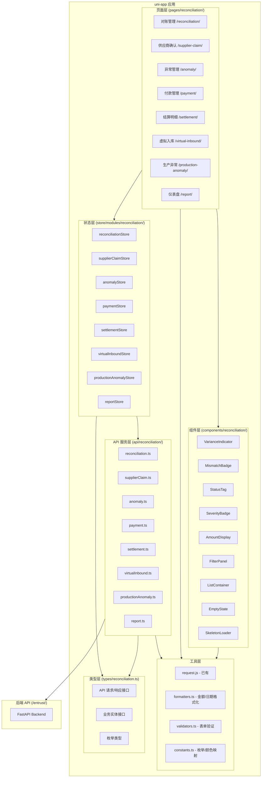
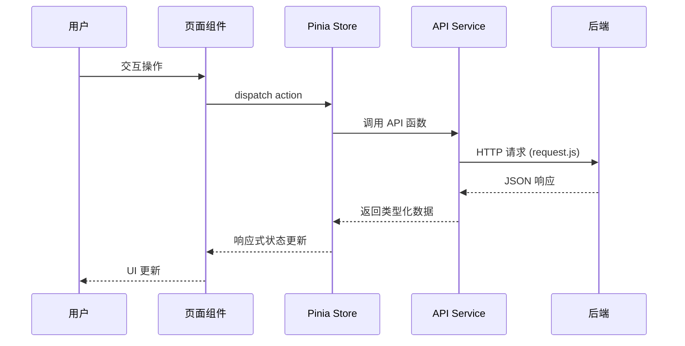
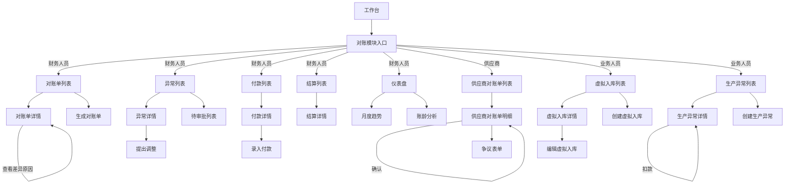

# Design Document: Reconciliation Frontend (对账系统前端)

## Overview

对账系统前端是基于 uni-app (Vue 3 Composition API) + Pinia + TailwindCSS + TypeScript 构建的移动端应用，目标平台为微信小程序（主要）和 H5。前端对接已完成的后端 API（`/entrust/` 前缀），实现对账管理、供应商确认、异常管理、付款管理、结算明细、虚拟入库、生产异常、仪表盘与报表等核心业务模块。

### 设计目标

1. **移动优先**：所有页面针对小屏幕优化，卡片式布局，信息分层展示
2. **类型安全**：全量 TypeScript 类型定义，API 请求/响应强类型
3. **状态一致**：Pinia 集中管理业务状态，列表缓存 + 滚动位置恢复
4. **复用性**：抽取通用业务组件（VarianceIndicator、MismatchBadge、StatusTag 等）
5. **兼容性**：基于现有 RuoYi-FastAPI 移动端框架，复用 request.js、auth、permission 等基础设施

### 技术栈

- **Framework**: uni-app (Vue 3 Composition API)
- **State**: Pinia 2.2.4
- **Styling**: TailwindCSS 3.4 + weapp-tailwindcss
- **Language**: TypeScript 5.x
- **Target**: 微信小程序 (primary) + H5
- **Base**: RuoYi-FastAPI mobile framework (existing)

## Architecture

### 系统架构图



### 数据流架构



### 目录结构

```
ruoyi-fastapi-app/src/
├── api/
│   └── reconciliation/
│       ├── reconciliation.ts       # 对账单 API
│       ├── supplierClaim.ts        # 供应商确认 API
│       ├── anomaly.ts              # 异常管理 API
│       ├── payment.ts              # 付款管理 API
│       ├── settlement.ts           # 结算明细 API
│       ├── virtualInbound.ts       # 虚拟入库 API
│       ├── productionAnomaly.ts    # 生产异常 API
│       └── report.ts              # 报表 API
├── components/
│   └── reconciliation/
│       ├── VarianceIndicator.vue   # 差异金额颜色标识
│       ├── MismatchBadge.vue       # 货不对板标识
│       ├── StatusTag.vue           # 状态标签
│       ├── SeverityBadge.vue       # 严重程度标识
│       ├── AmountDisplay.vue       # 金额显示（¥格式）
│       ├── FilterPanel.vue         # 筛选面板
│       ├── ListContainer.vue       # 列表容器（含刷新/加载更多）
│       ├── EmptyState.vue          # 空状态
│       ├── SkeletonLoader.vue      # 骨架屏
│       ├── ConfirmDialog.vue       # 二次确认对话框
│       └── SearchSelect.vue        # 搜索选择器（工单/零件）
├── pages/
│   └── reconciliation/
│       ├── index.vue               # 对账模块入口（功能卡片）
│       ├── statement/
│       │   ├── list.vue            # 对账单列表
│       │   ├── detail.vue          # 对账单详情
│       │   └── generate.vue        # 生成对账单
│       ├── supplier-claim/
│       │   ├── list.vue            # 供应商对账单列表
│       │   ├── detail.vue          # 供应商对账单明细
│       │   └── dispute.vue         # 争议表单
│       ├── anomaly/
│       │   ├── list.vue            # 异常列表
│       │   ├── detail.vue          # 异常详情
│       │   ├── adjustment.vue      # 提出调整
│       │   └── approval.vue        # 待审批列表
│       ├── payment/
│       │   ├── list.vue            # 付款申请列表
│       │   ├── detail.vue          # 付款详情
│       │   └── record.vue          # 录入付款
│       ├── settlement/
│       │   ├── list.vue            # 结算明细列表
│       │   └── detail.vue          # 结算详情（含编辑模式）
│       ├── virtual-inbound/
│       │   ├── list.vue            # 虚拟入库列表
│       │   ├── detail.vue          # 虚拟入库详情
│       │   ├── create.vue          # 创建虚拟入库
│       │   └── edit.vue            # 编辑虚拟入库
│       ├── production-anomaly/
│       │   ├── list.vue            # 生产异常列表
│       │   ├── detail.vue          # 生产异常详情
│       │   └── create.vue          # 创建生产异常
│       └── report/
│           ├── dashboard.vue       # 仪表盘
│           ├── trend.vue           # 月度趋势
│           └── aging.vue           # 账龄分析
├── store/
│   └── modules/
│       └── reconciliation/
│           ├── index.ts            # 统一导出
│           ├── reconciliation.ts   # 对账单 store
│           ├── supplierClaim.ts    # 供应商确认 store
│           ├── anomaly.ts          # 异常管理 store
│           ├── payment.ts          # 付款管理 store
│           ├── settlement.ts       # 结算明细 store
│           ├── virtualInbound.ts   # 虚拟入库 store
│           ├── productionAnomaly.ts # 生产异常 store
│           └── report.ts           # 报表 store
├── types/
│   └── reconciliation.ts          # 所有对账相关类型定义
└── utils/
    ├── reconciliation/
    │   ├── formatters.ts           # 金额/日期/状态格式化
    │   ├── validators.ts           # 表单验证规则
    │   └── constants.ts            # 枚举/颜色/状态映射
    └── request.js                  # 已有 - HTTP 请求封装
```

## Components and Interfaces

### 通用业务组件设计

#### 1. VarianceIndicator — 差异金额颜色标识

```vue
<!-- components/reconciliation/VarianceIndicator.vue -->
<template>
  <text :class="colorClass">{{ formattedAmount }}</text>
</template>

<script setup lang="ts">
import { computed } from 'vue'
import { formatAmount } from '@/utils/reconciliation/formatters'

const props = defineProps<{
  value: number       // 差异金额
  showSign?: boolean  // 是否显示正负号，默认 true
}>()

const colorClass = computed(() => {
  if (props.value > 0) return 'text-red-500 font-semibold'   // 正差异：供应商欠我们
  if (props.value < 0) return 'text-green-500 font-semibold' // 负差异
  return 'text-gray-600'                                      // 零差异
})

const formattedAmount = computed(() => {
  const sign = props.showSign !== false && props.value > 0 ? '+' : ''
  return `${sign}${formatAmount(props.value)}`
})
</script>
```

#### 2. MismatchBadge — 货不对板标识

```vue
<!-- components/reconciliation/MismatchBadge.vue -->
<template>
  <view v-if="show" class="flex items-center">
    <view class="w-1 h-full bg-red-500 rounded-full mr-2" />
    <text class="text-xs text-red-600 bg-red-50 px-2 py-0.5 rounded">
      货不对板
    </text>
  </view>
</template>

<script setup lang="ts">
defineProps<{ show: boolean }>()
</script>
```

#### 3. StatusTag — 状态标签

```vue
<!-- components/reconciliation/StatusTag.vue -->
<template>
  <text :class="['text-xs px-2 py-0.5 rounded-full', tagClass]">
    {{ label }}
  </text>
</template>

<script setup lang="ts">
import { computed } from 'vue'
import { getStatusConfig } from '@/utils/reconciliation/constants'

const props = defineProps<{
  status: string
  type?: 'statement' | 'settlement' | 'payment' | 'anomaly' | 'virtualInbound'
}>()

const config = computed(() => getStatusConfig(props.status, props.type))
const tagClass = computed(() => config.value.class)
const label = computed(() => config.value.label)
</script>
```

#### 4. SeverityBadge — 严重程度标识

```vue
<!-- components/reconciliation/SeverityBadge.vue -->
<template>
  <text :class="['text-xs px-2 py-0.5 rounded', badgeClass]">
    {{ label }}
  </text>
</template>

<script setup lang="ts">
import { computed } from 'vue'
import { getSeverityConfig } from '@/utils/reconciliation/constants'

const props = defineProps<{ severity: 'critical' | 'warning' | 'info' }>()

const config = computed(() => getSeverityConfig(props.severity))
const badgeClass = computed(() => config.value.class)
const label = computed(() => config.value.label)
</script>
```

#### 5. AmountDisplay — 金额显示

```vue
<!-- components/reconciliation/AmountDisplay.vue -->
<template>
  <text :class="['font-mono', sizeClass]">{{ formatted }}</text>
</template>

<script setup lang="ts">
import { computed } from 'vue'
import { formatAmount } from '@/utils/reconciliation/formatters'

const props = defineProps<{
  value: number
  size?: 'sm' | 'md' | 'lg'
}>()

const formatted = computed(() => formatAmount(props.value))
const sizeClass = computed(() => {
  switch (props.size) {
    case 'lg': return 'text-xl font-bold'
    case 'sm': return 'text-xs'
    default: return 'text-sm font-medium'
  }
})
</script>
```

#### 6. FilterPanel — 筛选面板

```vue
<!-- components/reconciliation/FilterPanel.vue -->
<template>
  <uni-popup ref="popup" type="top">
    <view class="bg-white p-4 rounded-b-xl shadow-lg">
      <slot />
      <view class="flex gap-3 mt-4">
        <button class="flex-1 btn-secondary" @click="handleReset">重置</button>
        <button class="flex-1 btn-primary" @click="handleConfirm">确认</button>
      </view>
    </view>
  </uni-popup>
</template>

<script setup lang="ts">
import { ref } from 'vue'

const popup = ref()
const emit = defineEmits<{
  confirm: []
  reset: []
}>()

const open = () => popup.value?.open()
const close = () => popup.value?.close()
const handleReset = () => { emit('reset'); close() }
const handleConfirm = () => { emit('confirm'); close() }

defineExpose({ open, close })
</script>
```

#### 7. ListContainer — 列表容器（含下拉刷新/上拉加载）

```vue
<!-- components/reconciliation/ListContainer.vue -->
<template>
  <scroll-view
    scroll-y
    class="h-full"
    :refresher-enabled="true"
    :refresher-triggered="refreshing"
    @refresherrefresh="handleRefresh"
    @scrolltolower="handleLoadMore"
  >
    <SkeletonLoader v-if="loading && !list.length" :count="3" />
    <slot v-else-if="list.length" />
    <EmptyState v-else :message="emptyText" />
    <view v-if="loadingMore" class="py-4 text-center text-gray-400 text-sm">
      加载中...
    </view>
    <view v-if="!hasMore && list.length" class="py-4 text-center text-gray-400 text-sm">
      没有更多了
    </view>
  </scroll-view>
</template>

<script setup lang="ts">
defineProps<{
  list: any[]
  loading: boolean
  loadingMore: boolean
  refreshing: boolean
  hasMore: boolean
  emptyText?: string
}>()

const emit = defineEmits<{
  refresh: []
  loadMore: []
}>()

const handleRefresh = () => emit('refresh')
const handleLoadMore = () => emit('loadMore')
</script>
```

#### 8. ConfirmDialog — 二次确认对话框

```vue
<!-- components/reconciliation/ConfirmDialog.vue -->
<template>
  <uni-popup ref="popup" type="dialog">
    <uni-popup-dialog
      :type="type"
      :title="title"
      :content="content"
      :before-close="true"
      @confirm="handleConfirm"
      @close="handleClose"
    />
  </uni-popup>
</template>

<script setup lang="ts">
import { ref } from 'vue'

defineProps<{
  title?: string
  content: string
  type?: 'info' | 'warning' | 'error'
}>()

const popup = ref()
const emit = defineEmits<{ confirm: []; close: [] }>()

const open = () => popup.value?.open()
const handleConfirm = () => { emit('confirm'); popup.value?.close() }
const handleClose = () => { emit('close'); popup.value?.close() }

defineExpose({ open })
</script>
```

### 页面路由设计 (pages.json 新增)

```json
{
  "pages": [
    {
      "path": "pages/reconciliation/index",
      "style": { "navigationBarTitleText": "对账管理" }
    },
    {
      "path": "pages/reconciliation/statement/list",
      "style": { "navigationBarTitleText": "对账单列表" }
    },
    {
      "path": "pages/reconciliation/statement/detail",
      "style": { "navigationBarTitleText": "对账单详情" }
    },
    {
      "path": "pages/reconciliation/statement/generate",
      "style": { "navigationBarTitleText": "生成对账单" }
    },
    {
      "path": "pages/reconciliation/supplier-claim/list",
      "style": { "navigationBarTitleText": "我的对账单" }
    },
    {
      "path": "pages/reconciliation/supplier-claim/detail",
      "style": { "navigationBarTitleText": "对账单明细" }
    },
    {
      "path": "pages/reconciliation/supplier-claim/dispute",
      "style": { "navigationBarTitleText": "提出争议" }
    },
    {
      "path": "pages/reconciliation/anomaly/list",
      "style": { "navigationBarTitleText": "异常记录" }
    },
    {
      "path": "pages/reconciliation/anomaly/detail",
      "style": { "navigationBarTitleText": "异常详情" }
    },
    {
      "path": "pages/reconciliation/anomaly/adjustment",
      "style": { "navigationBarTitleText": "提出调整" }
    },
    {
      "path": "pages/reconciliation/anomaly/approval",
      "style": { "navigationBarTitleText": "待审批" }
    },
    {
      "path": "pages/reconciliation/payment/list",
      "style": { "navigationBarTitleText": "付款管理" }
    },
    {
      "path": "pages/reconciliation/payment/detail",
      "style": { "navigationBarTitleText": "付款详情" }
    },
    {
      "path": "pages/reconciliation/payment/record",
      "style": { "navigationBarTitleText": "录入付款" }
    },
    {
      "path": "pages/reconciliation/settlement/list",
      "style": { "navigationBarTitleText": "结算明细" }
    },
    {
      "path": "pages/reconciliation/settlement/detail",
      "style": { "navigationBarTitleText": "结算详情" }
    },
    {
      "path": "pages/reconciliation/virtual-inbound/list",
      "style": { "navigationBarTitleText": "虚拟入库" }
    },
    {
      "path": "pages/reconciliation/virtual-inbound/detail",
      "style": { "navigationBarTitleText": "入库详情" }
    },
    {
      "path": "pages/reconciliation/virtual-inbound/create",
      "style": { "navigationBarTitleText": "创建虚拟入库" }
    },
    {
      "path": "pages/reconciliation/virtual-inbound/edit",
      "style": { "navigationBarTitleText": "编辑虚拟入库" }
    },
    {
      "path": "pages/reconciliation/production-anomaly/list",
      "style": { "navigationBarTitleText": "生产异常" }
    },
    {
      "path": "pages/reconciliation/production-anomaly/detail",
      "style": { "navigationBarTitleText": "异常详情" }
    },
    {
      "path": "pages/reconciliation/production-anomaly/create",
      "style": { "navigationBarTitleText": "创建生产异常" }
    },
    {
      "path": "pages/reconciliation/report/dashboard",
      "style": { "navigationBarTitleText": "对账概览" }
    },
    {
      "path": "pages/reconciliation/report/trend",
      "style": { "navigationBarTitleText": "月度趋势" }
    },
    {
      "path": "pages/reconciliation/report/aging",
      "style": { "navigationBarTitleText": "账龄分析" }
    }
  ]
}
```

### 导航流程图



### API 服务层设计

所有 API 服务基于现有 `src/utils/request.js` 封装，使用 TypeScript 定义请求/响应类型。

#### reconciliation.ts — 对账单 API

```typescript
// src/api/reconciliation/reconciliation.ts
import request from '@/utils/request'
import type {
  ReconciliationStatementVO,
  ReconciliationLineItemVO,
  VarianceSummaryVO,
  PageResult,
  StatementFilterParams,
  GenerateStatementParams,
} from '@/types/reconciliation'

/** 对账单列表（分页+筛选） */
export function getStatementList(params: StatementFilterParams) {
  return request({
    url: '/entrust/reconciliation/list',
    method: 'get',
    params,
  }) as Promise<PageResult<ReconciliationStatementVO>>
}

/** 对账单详情 */
export function getStatementDetail(id: number) {
  return request({
    url: `/entrust/reconciliation/${id}`,
    method: 'get',
  }) as Promise<ReconciliationStatementVO>
}

/** 对账单差异汇总 */
export function getVarianceSummary(id: number) {
  return request({
    url: `/entrust/reconciliation/${id}/variance-summary`,
    method: 'get',
  }) as Promise<VarianceSummaryVO>
}

/** 生成对账单 */
export function generateStatement(data: GenerateStatementParams) {
  return request({
    url: '/entrust/reconciliation/generate',
    method: 'post',
    data,
  }) as Promise<{ statement_ids: number[] }>
}

/** 重新计算差异 */
export function recalculateVariance(id: number) {
  return request({
    url: `/entrust/reconciliation/${id}/recalculate`,
    method: 'post',
  }) as Promise<void>
}

/** 发送对账通知 */
export function notifySupplier(id: number) {
  return request({
    url: `/entrust/reconciliation/${id}/notify`,
    method: 'post',
  }) as Promise<void>
}
```

#### supplierClaim.ts — 供应商确认 API

```typescript
// src/api/reconciliation/supplierClaim.ts
import request from '@/utils/request'
import type {
  ReconciliationStatementVO,
  PageResult,
  DisputeParams,
} from '@/types/reconciliation'

/** 供应商对账单列表 */
export function getSupplierStatements(params: { page: number; page_size: number }) {
  return request({
    url: '/entrust/supplier-claim/statements',
    method: 'get',
    params,
  }) as Promise<PageResult<ReconciliationStatementVO>>
}

/** 供应商对账单明细 */
export function getSupplierStatementDetail(id: number) {
  return request({
    url: `/entrust/supplier-claim/statements/${id}`,
    method: 'get',
  }) as Promise<ReconciliationStatementVO>
}

/** 供应商确认 */
export function confirmStatement(id: number) {
  return request({
    url: `/entrust/supplier-claim/statements/${id}/confirm`,
    method: 'post',
  }) as Promise<void>
}

/** 供应商提出争议 */
export function disputeStatement(id: number, data: DisputeParams) {
  return request({
    url: `/entrust/supplier-claim/statements/${id}/dispute`,
    method: 'post',
    data,
  }) as Promise<void>
}
```

#### anomaly.ts — 异常管理 API

```typescript
// src/api/reconciliation/anomaly.ts
import request from '@/utils/request'
import type {
  AnomalyVO,
  AdjustmentVO,
  PageResult,
  AnomalyFilterParams,
  CreateAdjustmentParams,
} from '@/types/reconciliation'

/** 异常记录列表 */
export function getAnomalyList(params: AnomalyFilterParams) {
  return request({
    url: '/entrust/anomaly/list',
    method: 'get',
    params,
  }) as Promise<PageResult<AnomalyVO>>
}

/** 异常详情 */
export function getAnomalyDetail(id: number) {
  return request({
    url: `/entrust/anomaly/${id}`,
    method: 'get',
  }) as Promise<AnomalyVO>
}

/** 提出金额调整 */
export function createAdjustment(id: number, data: CreateAdjustmentParams) {
  return request({
    url: `/entrust/anomaly/${id}/adjustment`,
    method: 'post',
    data,
  }) as Promise<void>
}

/** 待审批列表 */
export function getPendingApprovals(params: { page: number; page_size: number }) {
  return request({
    url: '/entrust/anomaly/adjustments/pending',
    method: 'get',
    params,
  }) as Promise<PageResult<AdjustmentVO>>
}

/** 审批通过 */
export function approveAdjustment(id: number) {
  return request({
    url: `/entrust/anomaly/adjustments/${id}/approve`,
    method: 'post',
  }) as Promise<void>
}

/** 审批驳回 */
export function rejectAdjustment(id: number, data: { reject_reason: string }) {
  return request({
    url: `/entrust/anomaly/adjustments/${id}/reject`,
    method: 'post',
    data,
  }) as Promise<void>
}
```

#### payment.ts — 付款管理 API

```typescript
// src/api/reconciliation/payment.ts
import request from '@/utils/request'
import type {
  PaymentRequestVO,
  PaymentRecordVO,
  PaymentEvidenceVO,
  PageResult,
  CreatePaymentRecordParams,
} from '@/types/reconciliation'

/** 付款申请列表 */
export function getPaymentRequests(params: { page: number; page_size: number }) {
  return request({
    url: '/entrust/payment/requests',
    method: 'get',
    params,
  }) as Promise<PageResult<PaymentRequestVO>>
}

/** 付款申请详情 */
export function getPaymentRequestDetail(id: number) {
  return request({
    url: `/entrust/payment/requests/${id}`,
    method: 'get',
  }) as Promise<PaymentRequestVO>
}

/** 录入付款记录 */
export function createPaymentRecord(requestId: number, data: CreatePaymentRecordParams) {
  return request({
    url: `/entrust/payment/requests/${requestId}/records`,
    method: 'post',
    data,
  }) as Promise<void>
}

/** 上传支付凭证 */
export function uploadEvidence(file: any) {
  return request({
    url: '/entrust/payment/evidences/upload',
    method: 'post',
    data: file,
    header: { 'Content-Type': 'multipart/form-data' },
  }) as Promise<PaymentEvidenceVO>
}

/** 删除凭证 */
export function deleteEvidence(id: number) {
  return request({
    url: `/entrust/payment/evidences/${id}`,
    method: 'delete',
  }) as Promise<void>
}
```

#### settlement.ts — 结算明细 API

```typescript
// src/api/reconciliation/settlement.ts
import request from '@/utils/request'
import type {
  SettlementDetailVO,
  PageResult,
} from '@/types/reconciliation'

/** 结算明细列表 */
export function getSettlementList(params: { page: number; page_size: number }) {
  return request({
    url: '/entrust/settlement/list',
    method: 'get',
    params,
  }) as Promise<PageResult<SettlementDetailVO>>
}

/** 结算明细详情 */
export function getSettlementDetail(id: number) {
  return request({
    url: `/entrust/settlement/${id}`,
    method: 'get',
  }) as Promise<SettlementDetailVO>
}

/** 编辑行项 */
export function updateSettlementLineItems(id: number, data: any) {
  return request({
    url: `/entrust/settlement/${id}/line-items`,
    method: 'put',
    data,
  }) as Promise<void>
}

/** 确认结算 */
export function finalizeSettlement(id: number) {
  return request({
    url: `/entrust/settlement/${id}/finalize`,
    method: 'post',
  }) as Promise<void>
}

/** 下载 PDF */
export function getSettlementPdf(id: number) {
  return request({
    url: `/entrust/settlement/${id}/pdf`,
    method: 'get',
    responseType: 'arraybuffer',
  }) as Promise<ArrayBuffer>
}

/** 差异原因明细 */
export function getVarianceDetail(id: number) {
  return request({
    url: `/entrust/settlement/${id}/variance-detail`,
    method: 'get',
  }) as Promise<any>
}
```

#### virtualInbound.ts — 虚拟入库 API

```typescript
// src/api/reconciliation/virtualInbound.ts
import request from '@/utils/request'
import type {
  VirtualInboundVO,
  PageResult,
  VirtualInboundFilterParams,
  CreateVirtualInboundParams,
  UpdateVirtualInboundParams,
} from '@/types/reconciliation'

/** 虚拟入库列表 */
export function getVirtualInboundList(params: VirtualInboundFilterParams) {
  return request({
    url: '/entrust/virtual-inbound/list',
    method: 'get',
    params,
  }) as Promise<PageResult<VirtualInboundVO>>
}

/** 虚拟入库详情 */
export function getVirtualInboundDetail(id: number) {
  return request({
    url: `/entrust/virtual-inbound/${id}`,
    method: 'get',
  }) as Promise<VirtualInboundVO>
}

/** 创建虚拟入库 */
export function createVirtualInbound(data: CreateVirtualInboundParams) {
  return request({
    url: '/entrust/virtual-inbound/',
    method: 'post',
    data,
  }) as Promise<{ id: number }>
}

/** 修改虚拟入库 */
export function updateVirtualInbound(id: number, data: UpdateVirtualInboundParams) {
  return request({
    url: `/entrust/virtual-inbound/${id}`,
    method: 'put',
    data,
  }) as Promise<void>
}

/** 删除虚拟入库 */
export function deleteVirtualInbound(id: number) {
  return request({
    url: `/entrust/virtual-inbound/${id}`,
    method: 'delete',
  }) as Promise<void>
}

/** 按工单查询 */
export function getVirtualInboundByOrder(orderId: number) {
  return request({
    url: `/entrust/virtual-inbound/by-order/${orderId}`,
    method: 'get',
  }) as Promise<VirtualInboundVO[]>
}
```

#### productionAnomaly.ts — 生产异常 API

```typescript
// src/api/reconciliation/productionAnomaly.ts
import request from '@/utils/request'
import type {
  ProductionAnomalyVO,
  PageResult,
  CreateProductionAnomalyParams,
  LiabilityParams,
  ReShipmentParams,
  DeductionParams,
  NegotiationParams,
} from '@/types/reconciliation'

/** 生产异常列表 */
export function getProductionAnomalyList(params: { page: number; page_size: number }) {
  return request({
    url: '/entrust/production-anomaly/list',
    method: 'get',
    params,
  }) as Promise<PageResult<ProductionAnomalyVO>>
}

/** 生产异常详情 */
export function getProductionAnomalyDetail(id: number) {
  return request({
    url: `/entrust/production-anomaly/${id}`,
    method: 'get',
  }) as Promise<ProductionAnomalyVO>
}

/** 创建生产异常 */
export function createProductionAnomaly(data: CreateProductionAnomalyParams) {
  return request({
    url: '/entrust/production-anomaly/',
    method: 'post',
    data,
  }) as Promise<{ id: number }>
}

/** 责任判定 */
export function setLiability(id: number, data: LiabilityParams) {
  return request({
    url: `/entrust/production-anomaly/${id}/liability`,
    method: 'put',
    data,
  }) as Promise<void>
}

/** 创建补发 */
export function createReShipment(id: number, data: ReShipmentParams) {
  return request({
    url: `/entrust/production-anomaly/${id}/re-shipment`,
    method: 'post',
    data,
  }) as Promise<void>
}

/** 创建扣款 */
export function createDeduction(id: number, data: DeductionParams) {
  return request({
    url: `/entrust/production-anomaly/${id}/deduction`,
    method: 'post',
    data,
  }) as Promise<void>
}

/** 记录协商 */
export function addNegotiation(id: number, data: NegotiationParams) {
  return request({
    url: `/entrust/production-anomaly/${id}/negotiation`,
    method: 'post',
    data,
  }) as Promise<void>
}
```

#### report.ts — 报表 API

```typescript
// src/api/reconciliation/report.ts
import request from '@/utils/request'
import type {
  DashboardVO,
  SupplierSummaryVO,
  MonthlyTrendVO,
  AgingAnalysisVO,
} from '@/types/reconciliation'

/** 仪表盘概览 */
export function getDashboard(params?: { start_date?: string; end_date?: string }) {
  return request({
    url: '/entrust/reconciliation-report/dashboard',
    method: 'get',
    params,
  }) as Promise<DashboardVO>
}

/** 供应商汇总 */
export function getSupplierSummary(params?: { start_date?: string; end_date?: string }) {
  return request({
    url: '/entrust/reconciliation-report/supplier-summary',
    method: 'get',
    params,
  }) as Promise<SupplierSummaryVO[]>
}

/** 月度趋势 */
export function getMonthlyTrend(params?: { months?: number }) {
  return request({
    url: '/entrust/reconciliation-report/monthly-trend',
    method: 'get',
    params,
  }) as Promise<MonthlyTrendVO[]>
}

/** 账龄分析 */
export function getAgingAnalysis() {
  return request({
    url: '/entrust/reconciliation-report/aging-analysis',
    method: 'get',
  }) as Promise<AgingAnalysisVO>
}

/** 导出 Excel */
export function exportExcel(params?: { start_date?: string; end_date?: string }) {
  return request({
    url: '/entrust/reconciliation-report/export/excel',
    method: 'get',
    params,
    responseType: 'arraybuffer',
  }) as Promise<ArrayBuffer>
}

/** 导出 PDF */
export function exportPdf(params?: { start_date?: string; end_date?: string }) {
  return request({
    url: '/entrust/reconciliation-report/export/pdf',
    method: 'get',
    params,
    responseType: 'arraybuffer',
  }) as Promise<ArrayBuffer>
}
```

### Pinia Store 设计

#### reconciliation store — 对账单状态管理

```typescript
// src/store/modules/reconciliation/reconciliation.ts
import { defineStore } from 'pinia'
import { ref, computed } from 'vue'
import {
  getStatementList,
  getStatementDetail,
  getVarianceSummary,
  generateStatement,
  recalculateVariance,
} from '@/api/reconciliation/reconciliation'
import type {
  ReconciliationStatementVO,
  VarianceSummaryVO,
  StatementFilterParams,
} from '@/types/reconciliation'

export const useReconciliationStore = defineStore('reconciliation', () => {
  // 列表状态
  const list = ref<ReconciliationStatementVO[]>([])
  const total = ref(0)
  const loading = ref(false)
  const loadingMore = ref(false)
  const currentPage = ref(1)
  const pageSize = 20
  const hasMore = computed(() => list.value.length < total.value)

  // 筛选条件
  const filters = ref<StatementFilterParams>({
    page: 1,
    page_size: pageSize,
  })

  // 当前详情
  const currentDetail = ref<ReconciliationStatementVO | null>(null)
  const varianceSummary = ref<VarianceSummaryVO | null>(null)

  // 列表操作
  async function fetchList(refresh = false) {
    if (refresh) {
      currentPage.value = 1
      filters.value.page = 1
    }
    loading.value = refresh || !list.value.length
    loadingMore.value = !refresh && currentPage.value > 1

    try {
      const res = await getStatementList(filters.value)
      if (refresh) {
        list.value = res.rows
      } else {
        list.value.push(...res.rows)
      }
      total.value = res.total
    } finally {
      loading.value = false
      loadingMore.value = false
    }
  }

  async function loadMore() {
    if (!hasMore.value || loadingMore.value) return
    currentPage.value++
    filters.value.page = currentPage.value
    await fetchList()
  }

  // 详情操作
  async function fetchDetail(id: number) {
    loading.value = true
    try {
      currentDetail.value = await getStatementDetail(id)
      varianceSummary.value = await getVarianceSummary(id)
    } finally {
      loading.value = false
    }
  }

  // 生成对账单
  async function generate(params: { period_start: string; period_end: string; supplier_id?: number }) {
    return await generateStatement(params)
  }

  // 重新计算差异
  async function recalculate(id: number) {
    await recalculateVariance(id)
    await fetchDetail(id)
  }

  function setFilters(newFilters: Partial<StatementFilterParams>) {
    Object.assign(filters.value, newFilters)
  }

  function $reset() {
    list.value = []
    total.value = 0
    currentPage.value = 1
    currentDetail.value = null
    varianceSummary.value = null
  }

  return {
    list, total, loading, loadingMore, hasMore, filters,
    currentDetail, varianceSummary,
    fetchList, loadMore, fetchDetail, generate, recalculate,
    setFilters, $reset,
  }
})
```

其他 Store 遵循相同模式（列表 + 筛选 + 详情 + 操作），核心差异：

| Store | 特殊状态 | 特殊操作 |
|-------|---------|---------|
| `useSupplierClaimStore` | — | `confirm()`, `dispute()` |
| `useAnomalyStore` | `pendingApprovals` | `createAdjustment()`, `approve()`, `reject()` |
| `usePaymentStore` | `paymentRecords`, `evidences` | `createRecord()`, `uploadEvidence()` |
| `useSettlementStore` | `editMode` | `updateLineItems()`, `finalize()`, `downloadPdf()` |
| `useVirtualInboundStore` | `orderInbounds` | `create()`, `update()`, `delete()`, `fetchByOrder()` |
| `useProductionAnomalyStore` | `negotiations` | `setLiability()`, `createReShipment()`, `createDeduction()` |
| `useReportStore` | `dashboard`, `trend`, `aging` | `exportExcel()`, `exportPdf()` |

## Data Models

### TypeScript 类型定义

```typescript
// src/types/reconciliation.ts

// ==================== 通用类型 ====================

/** 分页响应 */
export interface PageResult<T> {
  rows: T[]
  total: number
  page: number
  page_size: number
}

/** 分页请求参数 */
export interface PageParams {
  page: number
  page_size: number
}

// ==================== 枚举类型 ====================

/** 对账单状态 */
export type StatementStatus = 'pending' | 'confirmed' | 'disputed' | 'timeout' | 'paid'

/** 确认状态 */
export type ConfirmationStatus = 'pending' | 'confirmed' | 'disputed'

/** 结算状态 */
export type SettlementStatus = 'draft' | 'finalized'

/** 付款状态 */
export type PaymentStatus = 'pending_payment' | 'partially_paid' | 'paid'

/** 异常状态 */
export type AnomalyStatus = 'open' | 'investigating' | 'resolved' | 'closed'

/** 异常严重程度 */
export type Severity = 'critical' | 'warning' | 'info'

/** 异常类型 */
export type AnomalyType = 'amount_diff' | 'quantity_diff' | 'supplier_missing' | 'duplicate' | 'quality_dispute'

/** 生产异常类型 */
export type ProductionAnomalyType = 'material_damage' | 'process_error' | 'unusable'

/** 虚拟入库类型 */
export type InboundType = 're_shipment_in' | 'anomaly_deduction'

/** 虚拟入库状态 */
export type VirtualInboundStatus = 'pending' | 'confirmed' | 'linked_to_settlement' | 'cancelled'

/** 责任方 */
export type ResponsibleParty = 'material_supplier' | 'processor'

/** 审批状态 */
export type ApprovalStatus = 'pending_approval' | 'approved' | 'rejected'

/** 差异原因类型 */
export type VarianceReasonType =
  | 'material_damage'
  | 'process_error'
  | 'unusable'
  | 'partial_delivery'
  | 'virtual_inbound'
  | 'anomaly_deduction'

// ==================== 业务实体 VO ====================

/** 对账单 */
export interface ReconciliationStatementVO {
  id: number
  statement_no: string
  supplier_id: number
  supplier_name: string
  period_start: string
  period_end: string
  // 汇总
  total_ordered_amount: number
  total_received_value: number
  total_logistics_cost: number
  total_variance: number
  anomaly_count: number
  total_amount: number
  // 状态
  status: StatementStatus
  confirmation_status: ConfirmationStatus
  confirmed_at: string | null
  confirmed_by: number | null
  dispute_reason: string | null
  notified_at: string | null
  created_by: number
  created_at: string
  updated_at: string
  // 关联
  line_items?: ReconciliationLineItemVO[]
}

/** 对账单行项 */
export interface ReconciliationLineItemVO {
  id: number
  statement_id: number
  order_id: number | null
  order_no: string
  process_name: string | null
  part_no: string | null
  part_name: string | null
  // 订购基准
  ordered_quantity: number | null
  ordered_unit_price: number | null
  order_amount: number | null
  // 实际交付
  actual_delivered_qty: number | null
  actual_delivered_value: number
  // 虚拟入库
  virtual_inbound_value: number
  // 异常扣除
  anomaly_deduction_amount: number
  // 物流
  logistics_cost: number
  // 差异
  variance: number
  has_mismatch: boolean
  variance_reasons: VarianceReasonVO[] | null
  // 状态
  is_frozen: boolean
  created_at: string
  updated_at: string
}

/** 差异原因 */
export interface VarianceReasonVO {
  reason_type: VarianceReasonType
  description: string | null
  impact_amount: number
  responsible_party: ResponsibleParty | null
  production_anomaly_id: number | null
  virtual_inbound_id: number | null
  deduction_id: number | null
}

/** 差异汇总 */
export interface VarianceSummaryVO {
  total_ordered_amount: number
  total_received_value: number
  total_logistics_cost: number
  total_variance: number
  anomaly_count: number
  mismatch_count: number
}
```

```typescript
// (续) src/types/reconciliation.ts

/** 异常记录 */
export interface AnomalyVO {
  id: number
  statement_id: number
  statement_no: string
  line_item_id: number
  anomaly_type: AnomalyType
  severity: Severity
  diff_amount: number
  original_amount: number
  status: AnomalyStatus
  order_no: string
  description: string | null
  created_at: string
  updated_at: string
}

/** 调整记录 */
export interface AdjustmentVO {
  id: number
  anomaly_id: number
  line_item_id: number
  original_amount: number
  adjusted_amount: number
  adjustment_reason: string
  approval_status: ApprovalStatus
  approval_level: 'manager' | 'director'
  approved_by: number | null
  approved_at: string | null
  reject_reason: string | null
  created_by: number
  created_at: string
}

/** 付款申请 */
export interface PaymentRequestVO {
  id: number
  statement_id: number
  statement_no: string
  supplier_id: number
  supplier_name: string
  payable_amount: number
  paid_amount: number
  remaining_amount: number
  payment_status: PaymentStatus
  created_at: string
  records?: PaymentRecordVO[]
  evidences?: PaymentEvidenceVO[]
}

/** 付款记录 */
export interface PaymentRecordVO {
  id: number
  payment_request_id: number
  payment_amount: number
  payment_date: string
  bank_reference: string
  created_by: number
  created_at: string
}

/** 支付凭证 */
export interface PaymentEvidenceVO {
  id: number
  payment_request_id: number | null
  settlement_id: number | null
  file_name: string
  file_path: string
  file_type: string
  file_size: number
  thumbnail_url: string | null
  uploaded_by: number
  uploaded_at: string
}

/** 结算明细 */
export interface SettlementDetailVO {
  id: number
  order_id: number
  order_no: string
  supplier_id: number
  supplier_name: string
  statement_id: number | null
  status: SettlementStatus
  // 订购基准
  ordered_quantity: number | null
  ordered_unit_price: number | null
  ordered_amount: number
  // 实际交付
  actual_delivered_qty: number | null
  actual_delivered_amount: number
  // 虚拟入库
  virtual_inbound_amount: number
  // 异常扣除
  anomaly_deduction_amount: number
  // 物流
  logistics_cost: number
  // 差异
  variance: number
  variance_reasons: VarianceReasonVO[] | null
  // 利润
  total_cost: number
  customer_payment: number
  net_profit: number
  // 状态
  finalized_at: string | null
  finalized_by: number | null
  created_at: string
  updated_at: string
  // 关联
  line_items?: any[]
  evidences?: PaymentEvidenceVO[]
}

/** 虚拟入库 */
export interface VirtualInboundVO {
  id: number
  order_id: number
  order_no: string | null
  part_id: number | null
  part_no: string | null
  part_name: string | null
  inbound_type: InboundType
  quantity: number
  unit_price: number
  amount: number
  production_anomaly_id: number | null
  re_shipment_id: number | null
  anomaly_reason: string
  responsible_party: ResponsibleParty
  status: VirtualInboundStatus
  created_by: number | null
  created_at: string
  updated_at: string
}

/** 生产异常 */
export interface ProductionAnomalyVO {
  id: number
  order_id: number
  order_no: string
  part_id: number | null
  part_no: string | null
  part_name: string | null
  anomaly_type: ProductionAnomalyType
  description: string
  occurred_at: string
  liability_type: ResponsibleParty | null
  liability_description: string | null
  material_cost: number
  rework_cost: number
  delay_penalty: number
  total_loss: number
  status: string
  re_shipments?: ReShipmentVO[]
  deductions?: DeductionVO[]
  negotiations?: NegotiationRecordVO[]
  created_at: string
  updated_at: string
}

/** 补发记录 */
export interface ReShipmentVO {
  id: number
  production_anomaly_id: number
  part_id: number
  part_name: string
  quantity: number
  expected_ship_date: string
  actual_ship_date: string | null
  status: string
}

/** 扣款记录 */
export interface DeductionVO {
  id: number
  production_anomaly_id: number
  order_id: number
  amount: number
  reason: string
  status: string
  created_at: string
}

/** 协商记录 */
export interface NegotiationRecordVO {
  id: number
  production_anomaly_id: number
  content: string
  created_by: number
  created_at: string
}

// ==================== 报表 VO ====================

/** 仪表盘 */
export interface DashboardVO {
  total_statements: number
  confirmed_count: number
  disputed_count: number
  pending_count: number
  mismatch_order_count: number
  total_variance_amount: number
}

/** 供应商汇总 */
export interface SupplierSummaryVO {
  supplier_id: number
  supplier_name: string
  total_ordered_amount: number
  total_received_value: number
  total_variance: number
  anomaly_count: number
}

/** 月度趋势 */
export interface MonthlyTrendVO {
  month: string
  statement_count: number
  mismatch_ratio: number
  variance_amount: number
}

/** 账龄分析 */
export interface AgingAnalysisVO {
  buckets: AgingBucketVO[]
  total_unpaid: number
}

export interface AgingBucketVO {
  range: '0-30' | '31-60' | '61-90' | '90+'
  count: number
  amount: number
}
```

```typescript
// (续) src/types/reconciliation.ts

// ==================== 请求参数类型 ====================

/** 对账单筛选参数 */
export interface StatementFilterParams extends PageParams {
  supplier_id?: number
  status?: StatementStatus
  period_start?: string
  period_end?: string
}

/** 生成对账单参数 */
export interface GenerateStatementParams {
  period_start: string
  period_end: string
  supplier_id?: number
}

/** 争议参数 */
export interface DisputeParams {
  dispute_reason: string
  disputed_line_item_ids?: number[]
}

/** 异常筛选参数 */
export interface AnomalyFilterParams extends PageParams {
  anomaly_type?: AnomalyType
  severity?: Severity
  status?: AnomalyStatus
}

/** 创建调整参数 */
export interface CreateAdjustmentParams {
  adjusted_amount: number
  adjustment_reason: string
}

/** 创建付款记录参数 */
export interface CreatePaymentRecordParams {
  payment_amount: number
  payment_date: string
  bank_reference: string
}

/** 虚拟入库筛选参数 */
export interface VirtualInboundFilterParams extends PageParams {
  order_no?: string
  part_id?: number
  inbound_type?: InboundType
  responsible_party?: ResponsibleParty
}

/** 创建虚拟入库参数 */
export interface CreateVirtualInboundParams {
  order_id: number
  part_id: number
  inbound_type: InboundType
  quantity: number
  unit_price: number
  anomaly_reason: string
  responsible_party: ResponsibleParty
  production_anomaly_id?: number
  re_shipment_id?: number
}

/** 修改虚拟入库参数 */
export interface UpdateVirtualInboundParams {
  quantity?: number
  unit_price?: number
  anomaly_reason?: string
  responsible_party?: ResponsibleParty
}

/** 创建生产异常参数 */
export interface CreateProductionAnomalyParams {
  order_id: number
  part_id: number
  anomaly_type: ProductionAnomalyType
  description: string
  occurred_at: string
}

/** 责任判定参数 */
export interface LiabilityParams {
  liability_type: ResponsibleParty
  liability_description: string
}

/** 补发参数 */
export interface ReShipmentParams {
  part_id: number
  quantity: number
  expected_ship_date: string
}

/** 扣款参数 */
export interface DeductionParams {
  amount: number
  reason: string
}

/** 协商参数 */
export interface NegotiationParams {
  content: string
}
```

### 工具函数类型

```typescript
// src/utils/reconciliation/formatters.ts

/**
 * 格式化金额为 ¥X,XXX.XX 格式
 * @param value 金额数值
 * @returns 格式化后的字符串，如 "¥1,234.56"
 */
export function formatAmount(value: number | null | undefined): string {
  if (value == null) return '¥0.00'
  return `¥${value.toLocaleString('zh-CN', {
    minimumFractionDigits: 2,
    maximumFractionDigits: 2,
  })}`
}

/**
 * 格式化日期为 YYYY-MM-DD 格式
 */
export function formatDate(dateStr: string | null): string {
  if (!dateStr) return '-'
  return dateStr.slice(0, 10)
}

/**
 * 格式化对账周期
 */
export function formatPeriod(start: string, end: string): string {
  return `${formatDate(start)} ~ ${formatDate(end)}`
}
```

```typescript
// src/utils/reconciliation/validators.ts

/** 验证必填字段（非空、非纯空白） */
export function validateRequired(value: any): boolean {
  if (value == null) return false
  if (typeof value === 'string') return value.trim().length > 0
  return true
}

/** 验证金额字段（正数，最多2位小数） */
export function validateAmount(value: any): boolean {
  if (value == null || value === '') return false
  const num = Number(value)
  if (isNaN(num) || num <= 0) return false
  const parts = String(value).split('.')
  return parts.length <= 2 && (!parts[1] || parts[1].length <= 2)
}

/** 验证数量字段（正整数） */
export function validateQuantity(value: any): boolean {
  if (value == null || value === '') return false
  const num = Number(value)
  return Number.isInteger(num) && num > 0
}

/** 验证付款金额（正数且不超过剩余应付） */
export function validatePaymentAmount(value: any, remaining: number): boolean {
  if (!validateAmount(value)) return false
  return Number(value) <= remaining
}

/** 验证文件上传（类型+大小） */
export function validateFileUpload(
  fileName: string,
  fileSize: number,
  maxSize = 10 * 1024 * 1024 // 10MB
): { valid: boolean; error?: string } {
  const ext = fileName.split('.').pop()?.toLowerCase()
  const allowedExts = ['jpg', 'jpeg', 'png', 'pdf']
  if (!ext || !allowedExts.includes(ext)) {
    return { valid: false, error: `仅支持 ${allowedExts.join('/')} 格式` }
  }
  if (fileSize > maxSize) {
    return { valid: false, error: '文件大小不能超过 10MB' }
  }
  return { valid: true }
}
```

```typescript
// src/utils/reconciliation/constants.ts

/** 差异金额 → 颜色 class 映射 */
export function getVarianceColorClass(variance: number): string {
  if (variance > 0) return 'text-red-500'
  if (variance < 0) return 'text-green-500'
  return 'text-gray-600'
}

/** 严重程度配置 */
export function getSeverityConfig(severity: string) {
  const map: Record<string, { class: string; label: string }> = {
    critical: { class: 'bg-red-100 text-red-700', label: '严重' },
    warning: { class: 'bg-orange-100 text-orange-700', label: '警告' },
    info: { class: 'bg-blue-100 text-blue-700', label: '提示' },
  }
  return map[severity] || map.info
}

/** 状态标签配置 */
export function getStatusConfig(status: string, type?: string) {
  const statementMap: Record<string, { class: string; label: string }> = {
    pending: { class: 'bg-gray-100 text-gray-600', label: '待确认' },
    confirmed: { class: 'bg-green-100 text-green-700', label: '已确认' },
    disputed: { class: 'bg-orange-100 text-orange-700', label: '有争议' },
    timeout: { class: 'bg-red-100 text-red-700', label: '已超时' },
    paid: { class: 'bg-blue-100 text-blue-700', label: '已付款' },
  }
  const settlementMap: Record<string, { class: string; label: string }> = {
    draft: { class: 'bg-gray-100 text-gray-600', label: '草稿' },
    finalized: { class: 'bg-green-100 text-green-700', label: '已确认' },
  }
  const paymentMap: Record<string, { class: string; label: string }> = {
    pending_payment: { class: 'bg-gray-100 text-gray-600', label: '待付款' },
    partially_paid: { class: 'bg-orange-100 text-orange-700', label: '部分付款' },
    paid: { class: 'bg-green-100 text-green-700', label: '已付清' },
  }

  if (type === 'settlement') return settlementMap[status] || settlementMap.draft
  if (type === 'payment') return paymentMap[status] || paymentMap.pending_payment
  return statementMap[status] || statementMap.pending
}

/** 角色 → 可见模块映射 */
export const ROLE_MODULE_MAP: Record<string, string[]> = {
  financial: [
    'statement', 'supplier-claim', 'anomaly', 'payment',
    'settlement', 'virtual-inbound', 'production-anomaly', 'report',
  ],
  supplier: ['supplier-claim'],
  business: ['virtual-inbound', 'production-anomaly'],
}

/** 入库类型标签 */
export const INBOUND_TYPE_LABELS: Record<string, string> = {
  re_shipment_in: '补发入库',
  anomaly_deduction: '异常扣除',
}

/** 责任方标签 */
export const RESPONSIBLE_PARTY_LABELS: Record<string, string> = {
  material_supplier: '材料供应商',
  processor: '加工方',
}

/** 生产异常类型标签 */
export const PRODUCTION_ANOMALY_TYPE_LABELS: Record<string, string> = {
  material_damage: '材料损坏',
  process_error: '加工错误',
  unusable: '不可用',
}

/** 账龄分桶计算 */
export function getAgingBucket(daysSinceCreation: number): '0-30' | '31-60' | '61-90' | '90+' {
  if (daysSinceCreation <= 30) return '0-30'
  if (daysSinceCreation <= 60) return '31-60'
  if (daysSinceCreation <= 90) return '61-90'
  return '90+'
}

/** 错误码 → 中文消息映射 */
export const ERROR_CODE_MESSAGES: Record<number, string> = {
  400: '请求参数错误',
  401: '登录已过期，请重新登录',
  403: '权限不足，无法执行此操作',
  404: '请求的资源不存在',
  409: '操作冲突，当前状态不允许此操作',
  422: '数据验证失败',
  429: '请求过于频繁，请稍后再试',
  500: '服务器内部错误，请稍后重试',
}
```

## Correctness Properties

*A property is a characteristic or behavior that should hold true across all valid executions of a system—essentially, a formal statement about what the system should do. Properties serve as the bridge between human-readable specifications and machine-verifiable correctness guarantees.*

### Property 1: Amount formatting produces valid ¥ format

*For any* numeric value (including zero, negative, large numbers, and decimals), the `formatAmount` function SHALL produce a string matching the pattern `¥X,XXX.XX` with exactly 2 decimal places, where the integer part uses comma-separated thousands grouping.

**Validates: Requirements 1.12, 4.10, 5.11, 6.11, 7.12, 8.10**

### Property 2: Variance indicator color mapping

*For any* numeric variance value, the `getVarianceColorClass` function SHALL return: `'text-red-500'` if value > 0 (positive variance, supplier owes us), `'text-green-500'` if value < 0 (negative variance), and `'text-gray-600'` if value === 0 (balanced).

**Validates: Requirements 1.5, 2.4, 5.4, 12.2**

### Property 3: Severity color mapping

*For any* severity value in the set `{'critical', 'warning', 'info'}`, the `getSeverityConfig` function SHALL return: red-themed class for 'critical', orange-themed class for 'warning', and blue-themed class for 'info'. Each returned config SHALL contain both a non-empty `class` string and a non-empty `label` string.

**Validates: Requirements 3.12, 12.4**

### Property 4: Status tag color mapping

*For any* statement status value in the set `{'pending', 'confirmed', 'disputed', 'timeout', 'paid'}`, the `getStatusConfig` function SHALL return: gray for 'pending', green for 'confirmed', orange for 'disputed', red for 'timeout', and blue for 'paid'. Each returned config SHALL contain both a non-empty `class` string and a non-empty `label` string.

**Validates: Requirements 12.5**

### Property 5: State-based action visibility

*For any* entity with a status field, action buttons (edit/delete/confirm) SHALL be visible if and only if the entity is in an editable state. Specifically: (a) ReconciliationStatement actions visible only when status is 'pending'; (b) SettlementDetail edit/confirm visible only when status is 'draft'; (c) VirtualInbound edit/delete visible only when status is NOT 'linked_to_settlement'.

**Validates: Requirements 2.9, 5.5, 5.10, 6.7**

### Property 6: Pagination logic

*For any* total count ≥ 0 and page size of 20, the `hasMore` computed property SHALL return `true` if and only if the current loaded items count is less than total. The page size per request SHALL never exceed 20.

**Validates: Requirements 1.2, 2.2, 3.3**

### Property 7: File upload validation

*For any* file with a given name and size, the `validateFileUpload` function SHALL return `{ valid: true }` if and only if: (a) the file extension (case-insensitive) is one of 'jpg', 'jpeg', 'png', 'pdf', AND (b) the file size does not exceed 10MB (10,485,760 bytes). Otherwise it SHALL return `{ valid: false, error: <message> }`.

**Validates: Requirements 4.7**

### Property 8: Form field validation rules

*For any* input value: (a) `validateRequired` SHALL return `false` for null, undefined, empty string, or whitespace-only strings; (b) `validateAmount` SHALL return `true` if and only if the value is a positive number with at most 2 decimal places; (c) `validateQuantity` SHALL return `true` if and only if the value is a positive integer.

**Validates: Requirements 11.1, 11.2, 11.3**

### Property 9: Payment amount constraint

*For any* payment amount and remaining balance, `validatePaymentAmount` SHALL return `true` if and only if the amount is a valid positive number with at most 2 decimal places AND the amount is less than or equal to the remaining balance.

**Validates: Requirements 4.5**

### Property 10: Virtual inbound amount calculation

*For any* positive integer quantity and positive unit_price (with at most 2 decimal places), the computed amount SHALL equal `quantity × unit_price`.

**Validates: Requirements 6.4**

### Property 11: Aging bucket assignment

*For any* non-negative integer representing days since creation, the `getAgingBucket` function SHALL return: '0-30' for 0-30 days, '31-60' for 31-60 days, '61-90' for 61-90 days, and '90+' for values greater than 90.

**Validates: Requirements 8.4**

### Property 12: Role-based module visibility

*For any* user role, the visible module list SHALL be: 'financial' role sees all 8 modules, 'supplier' role sees only 'supplier-claim', 'business' role sees only 'virtual-inbound' and 'production-anomaly'. No role SHALL see modules outside its defined set.

**Validates: Requirements 9.3**

## Error Handling

### 前端错误处理策略

| 错误场景 | 处理方式 | 用户反馈 |
|---------|---------|---------|
| 网络断开 | 捕获 Network Error | Toast: "网络连接异常，请检查网络" + 重试按钮 |
| 请求超时 | 捕获 timeout | Toast: "请求超时，请稍后重试" |
| 401 未授权 | 跳转登录页 | 确认弹窗: "登录已过期，是否重新登录？" |
| 403 权限不足 | 阻止操作 | Toast: "权限不足，无法执行此操作" |
| 404 资源不存在 | 返回列表 | Toast: "数据不存在或已被删除" |
| 409 状态冲突 | 刷新页面数据 | Toast: 后端返回的具体冲突信息 |
| 422 验证失败 | 高亮错误字段 | 表单字段下方显示红色错误提示 |
| 500 服务器错误 | 记录错误 | Toast: "服务器异常，请稍后重试" |
| 文件上传失败 | 允许重试 | Toast: "上传失败" + 重试按钮 |
| 导出失败 | 允许重试 | Toast: "导出失败，请稍后重试" |

### 错误处理实现

```typescript
// 统一错误处理（已由 request.js 处理大部分场景）
// 业务层补充处理：

/** 表单提交错误处理 */
async function handleFormSubmit(submitFn: () => Promise<void>) {
  try {
    submitting.value = true
    await submitFn()
    uni.showToast({ title: '操作成功', icon: 'success' })
    // 返回上一页或刷新
    setTimeout(() => uni.navigateBack(), 1500)
  } catch (error: any) {
    // request.js 已处理 toast 提示
    // 此处仅处理表单级别的特殊逻辑
    if (error.response?.data?.code === 422) {
      // 高亮具体错误字段
      handleValidationErrors(error.response.data.detail)
    }
  } finally {
    submitting.value = false
  }
}

/** 列表加载错误处理 */
async function handleListFetch(fetchFn: () => Promise<void>) {
  try {
    await fetchFn()
  } catch (error) {
    // 网络错误时显示重试提示
    showRetryHint.value = true
  }
}
```

### 防重复提交

```typescript
// 通用 composable: useSubmit
export function useSubmit() {
  const submitting = ref(false)

  async function submit(fn: () => Promise<any>) {
    if (submitting.value) return
    submitting.value = true
    try {
      return await fn()
    } finally {
      submitting.value = false
    }
  }

  return { submitting, submit }
}
```

## Testing Strategy

### 测试框架选择

- **单元测试**: Vitest (与 Vite 生态一致)
- **属性测试**: fast-check (TypeScript PBT 库)
- **组件测试**: @vue/test-utils + Vitest
- **E2E 测试**: 微信小程序开发者工具自动化 (uni-automator)

### 属性测试 (Property-Based Testing)

本前端的核心工具函数（格式化、验证、映射）非常适合属性测试，因为它们是纯函数且输入空间大。

**配置要求**:
- 每个属性测试最少运行 100 次迭代
- 使用 `fc.assert(fc.property(...), { numRuns: 200 })` 配置
- 每个测试标注对应的设计属性

**PBT 库**: `fast-check`

**标签格式**: `Feature: reconciliation-frontend, Property {N}: {property_text}`

**属性测试覆盖范围**:

| Property | 测试目标 | 生成器策略 |
|----------|---------|-----------|
| P1 | 金额格式化 | `fc.double({ min: -999999999, max: 999999999 })` |
| P2 | 差异颜色映射 | `fc.double({ min: -100000, max: 100000 })` |
| P3 | 严重程度颜色 | `fc.constantFrom('critical', 'warning', 'info')` |
| P4 | 状态标签颜色 | `fc.constantFrom('pending', 'confirmed', 'disputed', 'timeout', 'paid')` |
| P5 | 状态可见性 | `fc.record({ status: fc.constantFrom(...), entityType: fc.constantFrom(...) })` |
| P6 | 分页逻辑 | `fc.record({ total: fc.nat(1000), loaded: fc.nat(1000) })` |
| P7 | 文件验证 | `fc.record({ name: fc.string(), size: fc.nat(50*1024*1024) })` |
| P8 | 表单验证 | `fc.oneof(fc.string(), fc.double(), fc.constant(null))` |
| P9 | 付款金额约束 | `fc.record({ amount: fc.double({min:0,max:100000}), remaining: fc.double({min:0,max:100000}) })` |
| P10 | 虚拟入库金额 | `fc.record({ quantity: fc.nat({max:10000}), unitPrice: fc.double({min:0.01,max:99999}) })` |
| P11 | 账龄分桶 | `fc.nat(365)` |
| P12 | 角色模块可见性 | `fc.constantFrom('financial', 'supplier', 'business')` |

### 单元测试覆盖范围

- **组件渲染测试**: VarianceIndicator、MismatchBadge、StatusTag、SeverityBadge 正确渲染
- **Store 操作测试**: 列表加载、分页、筛选、详情获取（mock API）
- **表单交互测试**: 验证规则触发、错误提示显示、提交流程
- **导航测试**: 页面跳转参数传递正确性
- **状态管理测试**: 缓存恢复、loading 状态切换

### 组件测试示例

```typescript
// 示例：VarianceIndicator 组件测试
import { mount } from '@vue/test-utils'
import VarianceIndicator from '@/components/reconciliation/VarianceIndicator.vue'

describe('VarianceIndicator', () => {
  it('正差异显示红色', () => {
    const wrapper = mount(VarianceIndicator, { props: { value: 100 } })
    expect(wrapper.find('text').classes()).toContain('text-red-500')
  })

  it('负差异显示绿色', () => {
    const wrapper = mount(VarianceIndicator, { props: { value: -50 } })
    expect(wrapper.find('text').classes()).toContain('text-green-500')
  })

  it('零差异显示默认色', () => {
    const wrapper = mount(VarianceIndicator, { props: { value: 0 } })
    expect(wrapper.find('text').classes()).toContain('text-gray-600')
  })
})
```

### 属性测试示例

```typescript
// 示例：金额格式化属性测试
import * as fc from 'fast-check'
import { formatAmount } from '@/utils/reconciliation/formatters'

describe('Property 1: Amount formatting', () => {
  // Feature: reconciliation-frontend, Property 1: Amount formatting produces valid ¥ format
  it('should always produce ¥X.XX format with 2 decimal places', () => {
    fc.assert(
      fc.property(
        fc.double({ min: -999999999, max: 999999999, noNaN: true }),
        (value) => {
          const result = formatAmount(value)
          // 必须以 ¥ 开头
          expect(result.startsWith('¥')).toBe(true)
          // 必须有恰好 2 位小数
          const parts = result.replace('¥', '').replace(/,/g, '').split('.')
          expect(parts.length).toBe(2)
          expect(parts[1].length).toBe(2)
        }
      ),
      { numRuns: 200 }
    )
  })
})
```

## Visual Design Specs

### 颜色系统

| 用途 | 颜色值 | TailwindCSS Class | 场景 |
|------|--------|-------------------|------|
| 正差异（供应商欠我们） | #EF4444 | `text-red-500` | 差异金额 > 0 |
| 负差异 | #22C55E | `text-green-500` | 差异金额 < 0 |
| 零差异 | #4B5563 | `text-gray-600` | 差异金额 = 0 |
| 货不对板标识 | #DC2626 | `bg-red-500` (竖条) + `text-red-600 bg-red-50` (标签) | has_mismatch = true |
| Critical 异常 | #FEE2E2 / #B91C1C | `bg-red-100 text-red-700` | severity = critical |
| Warning 异常 | #FFEDD5 / #C2410C | `bg-orange-100 text-orange-700` | severity = warning |
| Info 异常 | #DBEAFE / #1D4ED8 | `bg-blue-100 text-blue-700` | severity = info |
| 待确认状态 | #F3F4F6 / #4B5563 | `bg-gray-100 text-gray-600` | status = pending |
| 已确认状态 | #DCFCE7 / #15803D | `bg-green-100 text-green-700` | status = confirmed |
| 有争议状态 | #FFEDD5 / #C2410C | `bg-orange-100 text-orange-700` | status = disputed |
| 已超时状态 | #FEE2E2 / #B91C1C | `bg-red-100 text-red-700` | status = timeout |
| 已付款状态 | #DBEAFE / #1D4ED8 | `bg-blue-100 text-blue-700` | status = paid |
| 主按钮 | #3B82F6 | `bg-blue-500 text-white` | 确认、提交 |
| 危险按钮 | #EF4444 | `bg-red-500 text-white` | 删除 |
| 次要按钮 | #F3F4F6 | `bg-gray-100 text-gray-700` | 取消、重置 |

### 间距规范

| 元素 | 间距 | TailwindCSS |
|------|------|-------------|
| 页面内边距 | 16px | `p-4` |
| 卡片间距 | 12px | `space-y-3` |
| 卡片内边距 | 16px | `p-4` |
| 卡片圆角 | 12px | `rounded-xl` |
| 标签内边距 | 4px 8px | `px-2 py-0.5` |
| 表单项间距 | 16px | `space-y-4` |
| 按钮高度 | 44px | `h-11` |
| 列表项最小高度 | 72px | `min-h-[72px]` |

### 字体规范

| 用途 | 大小 | 权重 | TailwindCSS |
|------|------|------|-------------|
| 页面标题 | 18px | Bold | `text-lg font-bold` |
| 卡片标题 | 16px | Semibold | `text-base font-semibold` |
| 正文 | 14px | Normal | `text-sm` |
| 辅助文字 | 12px | Normal | `text-xs text-gray-500` |
| 金额数字 | 16px | Bold + Mono | `text-base font-bold font-mono` |
| 大金额（仪表盘） | 24px | Bold + Mono | `text-2xl font-bold font-mono` |
| 标签文字 | 12px | Medium | `text-xs font-medium` |

### 卡片布局规范

```
┌─────────────────────────────────────┐
│ [StatusTag]              [日期]      │  ← 顶部：状态 + 时间
│                                     │
│ 对账单编号: REC-202501-001-001      │  ← 主标题
│ 供应商: XX加工厂                     │  ← 副标题
│                                     │
│ ┌─────────┐  ┌─────────┐           │
│ │订购总额  │  │差异金额  │           │  ← 关键数据区
│ │¥12,345.00│  │+¥1,234.00│          │
│ └─────────┘  └─────────┘           │
│                                     │
│ [MismatchBadge: 货不对板 x3]        │  ← 底部标识
└─────────────────────────────────────┘
```

### 货不对板行项样式

```
┌──┬──────────────────────────────────┐
│红│ 委外单号: EO-2025-001            │
│色│ 零件: 轴承座 A-001               │
│竖│                                  │
│条│ 订购: ¥5,000.00  实收: ¥4,200.00 │
│  │ 差异: +¥800.00 [货不对板]        │
│  │                                  │
│  │ ▶ 差异原因 (2条)                 │  ← 可展开
└──┴──────────────────────────────────┘
```

### 骨架屏设计

列表页骨架屏模拟 3 个卡片占位，每个卡片包含：
- 顶部：短条 (状态) + 短条 (日期)
- 中部：长条 (标题) + 中条 (副标题)
- 底部：两个方块 (金额区)

### 空状态设计

- 图标：使用 `mdi:file-document-outline` 图标
- 文字：根据场景显示不同提示
  - 列表为空："暂无数据"
  - 搜索无结果："未找到匹配的记录"
  - 网络错误："加载失败，点击重试"

