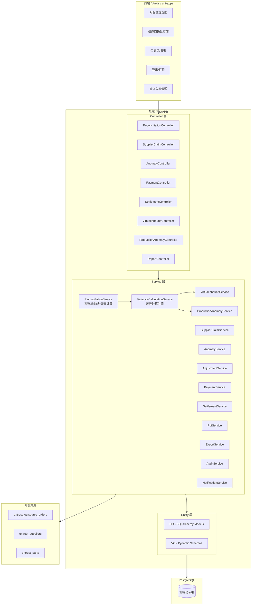
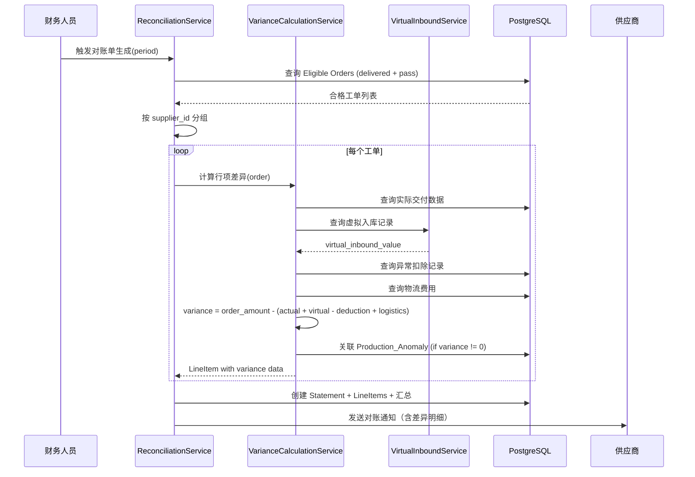
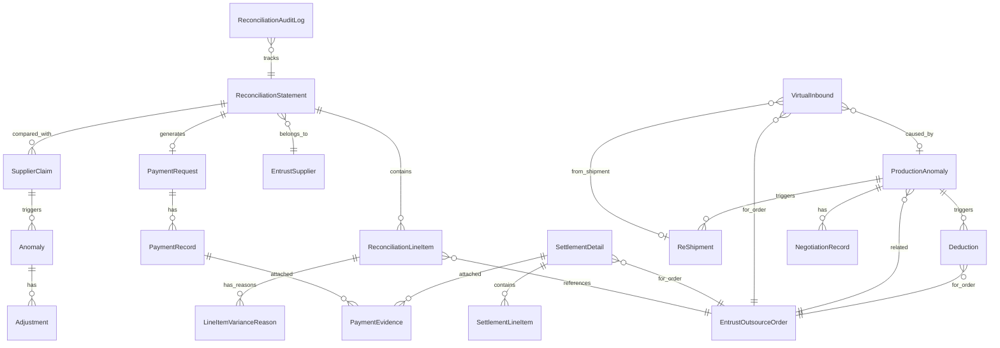

# Design Document: Reconciliation System (对账系统)

## Overview

对账系统是委外加工业务链的结算核心模块。**核心逻辑变更：以委外订购单为基准，对比"下单花的钱" vs "实际收到的产品价值"**，按月度、按供应商维度生成对账单，逐单计算差异并自动追溯异常原因。

### 对账核心公式

```
对账差异 = 订购金额 −（实际交付价值 + 虚拟入库价值 − 异常扣除金额 + 物流费用）
```

- **订购金额 (order_amount)**：委外订购单约定的总金额 = ordered_quantity × ordered_unit_price
- **实际交付价值 (actual_delivered_value)**：供应商实际交付且质检合格的产品价值 = actual_delivered_qty × unit_price
- **虚拟入库价值 (virtual_inbound_value)**：因异常补发的材料/零件价值 = Σ(virtual_inbound.quantity × virtual_inbound.unit_price)
- **异常扣除金额 (anomaly_deduction_amount)**：因问题决定不补发，直接从订单中扣除的款项 = Σ(deduction.amount)
- **物流费用 (logistics_cost)**：该订单产生的运输/物流费用

当差异不为零时，系统自动关联 Production_Anomaly 和 Virtual_Inbound 记录，逐条列出差异原因。

### 设计目标

1. **准确性**：以订购单为基准，逐单对比订购金额与实际收到价值，差异自动追溯
2. **可追溯性**：每笔差异关联具体的生产异常记录，说明"货不对板"的根本原因
3. **合规性**：审批流程分级控制，数据不可变性保障，完整审计日志
4. **高效性**：自动化对账单生成、差异计算、异常关联、付款申请
5. **可扩展性**：遵循现有 module_entrust 架构模式，新增实体与现有实体平滑集成

### 技术栈

- **Backend**: Python FastAPI (async) + SQLAlchemy ORM + PostgreSQL
- **Architecture**: module_entrust 模式 (controller/service/entity/do+vo)
- **PDF Generation**: ReportLab
- **Excel Export**: openpyxl
- **Frontend**: Vue.js (uni-app)

## Architecture

### 系统架构图



### 模块目录结构

```
module_entrust/
├── controller/
│   ├── reconciliation_controller.py      # 对账单 CRUD + 生成 + 差异查看
│   ├── supplier_claim_controller.py      # 供应商账单提交/确认
│   ├── anomaly_controller.py             # 异常管理 + 调整审批
│   ├── payment_controller.py             # 付款申请/记录/凭证
│   ├── settlement_controller.py          # 结算明细 + PDF
│   ├── virtual_inbound_controller.py     # 虚拟入库管理 (NEW)
│   ├── production_anomaly_controller.py  # 生产异常/责任判定
│   └── reconciliation_report_controller.py  # 报表/仪表盘
├── service/
│   ├── reconciliation_service.py         # 对账单生成核心逻辑 (MODIFIED)
│   ├── variance_calculation_service.py   # 差异计算引擎 (NEW)
│   ├── virtual_inbound_service.py        # 虚拟入库服务 (NEW)
│   ├── supplier_claim_service.py         # 供应商账单比对
│   ├── anomaly_service.py                # 异常检测 + 调整审批
│   ├── payment_service.py                # 付款流程
│   ├── settlement_service.py             # 结算明细 (MODIFIED)
│   ├── production_anomaly_service.py     # 生产异常/责任判定
│   ├── reconciliation_pdf_service.py     # PDF 生成
│   ├── reconciliation_export_service.py  # Excel 导出
│   ├── reconciliation_audit_service.py   # 审计日志
│   ├── reconciliation_notification_service.py  # 通知
│   ├── reconciliation_report_service.py  # 报表统计
│   └── reconciliation_security_service.py # 安全控制
├── entity/
│   ├── do/
│   │   └── reconciliation_do.py          # 所有对账相关 ORM 模型 (MODIFIED)
│   └── vo/
│       └── reconciliation_vo.py          # 所有对账相关 Pydantic 模型
└── dao/
    └── (可选，复杂查询封装)
```

### 核心流程时序图：订单级对账



## Components and Interfaces

### Controller 层 API 设计

#### 1. ReconciliationController (`/entrust/reconciliation`)

| Method | Path | Summary |
|--------|------|---------|
| POST | `/generate` | 生成对账单（含差异计算） |
| GET | `/list` | 对账单列表（分页+筛选） |
| GET | `/{id}` | 对账单详情（含行项+差异+原因） |
| GET | `/{id}/variance-summary` | 对账单差异汇总 |
| PUT | `/{id}/line-items/{item_id}` | 编辑行项（pending 状态） |
| POST | `/{id}/line-items` | 新增行项 |
| DELETE | `/{id}/line-items/{item_id}` | 删除行项 |
| POST | `/{id}/notify` | 手动发送对账通知 |
| POST | `/{id}/recalculate` | 重新计算差异（手动触发） |

#### 2. SupplierClaimController (`/entrust/supplier-claim`)

| Method | Path | Summary |
|--------|------|---------|
| GET | `/statements` | 供应商查看自己的对账单列表 |
| GET | `/statements/{id}` | 供应商查看对账单明细（含差异原因） |
| POST | `/statements/{id}/confirm` | 供应商确认 |
| POST | `/statements/{id}/dispute` | 供应商提出争议（可针对具体行项） |
| POST | `/claims` | 供应商提交账单 |

#### 3. AnomalyController (`/entrust/anomaly`)

| Method | Path | Summary |
|--------|------|---------|
| GET | `/list` | 异常记录列表 |
| GET | `/{id}` | 异常详情 |
| PUT | `/{id}/status` | 更新异常状态 |
| POST | `/{id}/adjustment` | 提出金额调整 |
| POST | `/adjustments/{id}/approve` | 审批通过 |
| POST | `/adjustments/{id}/reject` | 审批驳回 |
| GET | `/adjustments/pending` | 待审批列表 |

#### 4. PaymentController (`/entrust/payment`)

| Method | Path | Summary |
|--------|------|---------|
| GET | `/requests` | 付款申请列表 |
| GET | `/requests/{id}` | 付款申请详情 |
| POST | `/requests/{id}/records` | 录入付款记录 |
| GET | `/requests/{id}/records` | 查看付款记录 |
| POST | `/evidences/upload` | 上传支付凭证 |
| GET | `/evidences/{id}` | 查看凭证 |
| DELETE | `/evidences/{id}` | 删除凭证（非 finalized） |

#### 5. SettlementController (`/entrust/settlement`)

| Method | Path | Summary |
|--------|------|---------|
| GET | `/list` | 结算明细列表 |
| GET | `/{id}` | 结算明细详情（含订购vs实际对比） |
| PUT | `/{id}/line-items` | 编辑行项（draft 状态） |
| POST | `/{id}/finalize` | 确认结算明细 |
| GET | `/{id}/pdf` | 生成/下载 PDF 结算单 |
| GET | `/{id}/variance-detail` | 查看差异原因明细 |

#### 6. VirtualInboundController (`/entrust/virtual-inbound`) — NEW

| Method | Path | Summary |
|--------|------|---------|
| GET | `/list` | 虚拟入库记录列表（支持筛选） |
| GET | `/{id}` | 虚拟入库详情 |
| POST | `/` | 手动创建虚拟入库记录 |
| PUT | `/{id}` | 修改虚拟入库记录（非 finalized） |
| DELETE | `/{id}` | 删除虚拟入库记录（非 finalized） |
| GET | `/by-order/{order_id}` | 按工单查询虚拟入库记录 |

#### 7. ProductionAnomalyController (`/entrust/production-anomaly`)

| Method | Path | Summary |
|--------|------|---------|
| POST | `/` | 创建生产异常 |
| GET | `/list` | 生产异常列表 |
| GET | `/{id}` | 生产异常详情 |
| PUT | `/{id}/liability` | 判定责任方 |
| POST | `/{id}/re-shipment` | 创建补发请求 |
| POST | `/{id}/deduction` | 创建扣款记录 |
| POST | `/{id}/negotiation` | 记录协商过程 |

#### 8. ReportController (`/entrust/reconciliation-report`)

| Method | Path | Summary |
|--------|------|---------|
| GET | `/dashboard` | 对账概览仪表盘（含货不对板统计） |
| GET | `/supplier-summary` | 供应商汇总（订购总额/实收总额/差异） |
| GET | `/monthly-trend` | 月度趋势（货不对板比例） |
| GET | `/aging-analysis` | 账龄分析 |
| GET | `/export/excel` | 导出 Excel |
| GET | `/export/pdf` | 导出 PDF |
| GET | `/export/anomaly-report` | 导出异常报告 |

### Service 层核心接口

```python
class VarianceCalculationService:
    """差异计算引擎 — 核心对账逻辑 (NEW)"""

    @staticmethod
    def calculate_order_variance(
        order_amount: Decimal,
        actual_delivered_value: Decimal,
        virtual_inbound_value: Decimal,
        anomaly_deduction_amount: Decimal,
        logistics_cost: Decimal,
    ) -> Decimal:
        """
        计算单个订单的对账差异（纯函数）。
        
        variance = order_amount - (actual_delivered_value + virtual_inbound_value
                                   - anomaly_deduction_amount + logistics_cost)
        """

    @staticmethod
    async def compute_line_item_variance(
        db: AsyncSession, order: EntrustOutsourceOrder
    ) -> LineItemVarianceResult:
        """
        计算单个工单的完整差异数据，包括：
        - actual_delivered_value: 实际交付价值
        - virtual_inbound_value: 虚拟入库价值
        - anomaly_deduction_amount: 异常扣除金额
        - logistics_cost: 物流费用
        - variance: 差异金额
        - variance_reasons: 差异原因列表（关联的异常记录）
        """

    @staticmethod
    async def link_variance_reasons(
        db: AsyncSession, order_id: int, variance: Decimal
    ) -> list[VarianceReason]:
        """
        当 variance != 0 时，自动关联导致差异的 Production_Anomaly
        和 Virtual_Inbound 记录，生成差异原因列表。
        """


class ReconciliationService:
    """对账单生成与管理服务 (MODIFIED)"""

    @staticmethod
    async def generate_statements(
        db: AsyncSession, period_start: date, period_end: date,
        supplier_id: Optional[int] = None, created_by: int = 0
    ) -> list[int]:
        """
        生成对账单 — 以订购单为基准，逐单计算差异。
        
        变更点：
        - 每个行项现在包含 ordered_quantity, ordered_unit_price, order_amount
        - 每个行项计算 actual_received_value, virtual_inbound_value,
          anomaly_deduction_amount, logistics_cost, variance
        - variance != 0 的行项自动关联差异原因
        - 汇总包含：订购总金额、实收总价值、差异总金额、异常笔数
        """

    @staticmethod
    async def calculate_summary(db: AsyncSession, statement_id: int) -> dict:
        """
        重新计算对账单汇总（扩展版）。
        
        返回：{
            total_ordered_amount,      # 订购总金额
            total_received_value,      # 实际收到总价值
            total_logistics_cost,      # 物流总费用
            total_variance,            # 差异总金额
            anomaly_count,             # 异常笔数
            mismatch_count,            # 货不对板行项数
        }
        """


class VirtualInboundService:
    """虚拟入库服务 (NEW)"""

    @staticmethod
    async def create_virtual_inbound(
        db: AsyncSession, order_id: int, part_id: int,
        inbound_type: str, quantity: int, unit_price: Decimal,
        anomaly_reason: str, responsible_party: str,
        re_shipment_id: Optional[int] = None,
        production_anomaly_id: Optional[int] = None,
        created_by: int = 0,
    ) -> int:
        """创建虚拟入库记录"""

    @staticmethod
    async def get_inbound_value_for_order(
        db: AsyncSession, order_id: int
    ) -> Decimal:
        """计算指定工单的虚拟入库总价值"""

    @staticmethod
    async def list_by_order(
        db: AsyncSession, order_id: int
    ) -> list[VirtualInbound]:
        """查询指定工单的所有虚拟入库记录"""


class SettlementService:
    """订单结算明细服务 (MODIFIED)"""

    @staticmethod
    async def generate_settlement_detail(
        db: AsyncSession, order_id: int
    ) -> int:
        """
        生成结算明细 — 以订购单为基准展示对比。
        
        变更点：
        - 新增字段：ordered_quantity, ordered_unit_price, ordered_amount
        - 新增字段：actual_delivered_qty, actual_delivered_amount
        - 新增字段：virtual_inbound_amount, anomaly_deduction_amount
        - 新增字段：logistics_cost, variance, variance_reasons (JSONB)
        - 净利润计算公式调整
        """
```

## Data Models

### ER 关系图（更新版）



### SQLAlchemy ORM 模型定义

#### 1. ReconciliationStatement (对账单) — 新增汇总字段

```python
class ReconciliationStatement(Base):
    """对账单 — 以订购单为基准的对账清单"""
    __tablename__ = 'reconciliation_statements'

    id = Column(Integer, primary_key=True, autoincrement=True)
    statement_no = Column(String(64), nullable=False, unique=True,
                          comment='对账单编号 REC-{YYYYMM}-{supplier_id}-{seq}')
    supplier_id = Column(Integer, nullable=False, comment='供应商ID')
    period_start = Column(Date, nullable=False, comment='对账周期起始')
    period_end = Column(Date, nullable=False, comment='对账周期结束')

    # === 汇总字段（新增/修改） ===
    total_ordered_amount = Column(Numeric(14, 2), default=0,
                                   comment='订购总金额')
    total_received_value = Column(Numeric(14, 2), default=0,
                                   comment='实际收到总价值(含虚拟入库)')
    total_logistics_cost = Column(Numeric(14, 2), default=0,
                                   comment='物流总费用')
    total_variance = Column(Numeric(14, 2), default=0,
                            comment='差异总金额')
    anomaly_count = Column(Integer, default=0,
                           comment='异常笔数(variance!=0的行项数)')
    total_amount = Column(Numeric(14, 2), default=0,
                          comment='应付金额(=total_received_value+total_logistics_cost)')

    # === 状态字段（不变） ===
    status = Column(String(32), default='pending',
                    comment='状态: pending/confirmed/disputed/timeout/paid')
    confirmation_status = Column(String(32), default='pending',
                                  comment='确认状态: pending/confirmed/disputed')
    confirmed_at = Column(DateTime, comment='确认时间')
    confirmed_by = Column(BigInteger, comment='确认人')
    dispute_reason = Column(Text, comment='争议说明')
    notified_at = Column(DateTime, comment='通知发送时间')
    timeout_at = Column(DateTime, comment='超时标记时间')
    created_by = Column(BigInteger, comment='创建人')
    created_at = Column(DateTime, default=datetime.now)
    updated_at = Column(DateTime, default=datetime.now, onupdate=datetime.now)
```

#### 2. ReconciliationLineItem (对账单行项) — 重大变更

```python
class ReconciliationLineItem(Base):
    """对账单行项 — 每行对应一笔委外订购单，含差异计算"""
    __tablename__ = 'reconciliation_line_items'

    id = Column(Integer, primary_key=True, autoincrement=True)
    statement_id = Column(Integer, nullable=False, comment='对账单ID')
    order_id = Column(Integer, comment='委外工单ID')
    order_no = Column(String(64), nullable=False, comment='委外单号')
    process_name = Column(String(200), comment='工序名称')
    part_no = Column(String(64), comment='零件编号')
    part_name = Column(String(255), comment='零件名称')

    # === 订购基准（新增） ===
    ordered_quantity = Column(Integer, comment='订购数量')
    ordered_unit_price = Column(Numeric(14, 2), comment='订购单价')
    order_amount = Column(Numeric(14, 2), comment='订购金额 = ordered_quantity × ordered_unit_price')

    # === 实际交付（新增） ===
    actual_delivered_qty = Column(Integer, comment='实际交付数量(质检合格)')
    actual_delivered_value = Column(Numeric(14, 2), default=0,
                                    comment='实际交付价值 = actual_delivered_qty × unit_price')

    # === 虚拟入库（新增） ===
    virtual_inbound_value = Column(Numeric(14, 2), default=0,
                                    comment='虚拟入库价值(补发部分)')

    # === 异常扣除（新增） ===
    anomaly_deduction_amount = Column(Numeric(14, 2), default=0,
                                      comment='异常扣除金额(不补发部分)')

    # === 物流费用（新增） ===
    logistics_cost = Column(Numeric(14, 2), default=0, comment='物流费用')

    # === 差异计算结果（新增） ===
    variance = Column(Numeric(14, 2), default=0,
                      comment='差异金额 = order_amount - (actual + virtual - deduction + logistics)')
    has_mismatch = Column(Boolean, default=False,
                          comment='是否货不对板(variance != 0)')
    variance_reasons = Column(JSONB, comment='差异原因列表(关联的异常记录摘要)')

    # === 保留字段 ===
    unit_price = Column(Numeric(14, 2), comment='单价(兼容旧数据)')
    quantity = Column(Integer, comment='数量(兼容旧数据)')
    total_amount = Column(Numeric(14, 2), comment='行项金额(=order_amount, 兼容)')
    is_frozen = Column(Boolean, default=False, comment='是否冻结(调整审批中)')
    created_at = Column(DateTime, default=datetime.now)
    updated_at = Column(DateTime, default=datetime.now, onupdate=datetime.now)
```

#### 3. VirtualInbound (虚拟入库) — 新增实体

```python
class VirtualInbound(Base):
    """虚拟入库记录 — 因异常补发的材料/零件登记"""
    __tablename__ = 'reconciliation_virtual_inbounds'
    __table_args__ = (
        Index('ix_virtual_inbound_order', 'order_id'),
        Index('ix_virtual_inbound_type', 'inbound_type'),
        Index('ix_virtual_inbound_status', 'status'),
        {'comment': '虚拟入库记录'},
    )

    id = Column(Integer, primary_key=True, autoincrement=True)
    order_id = Column(Integer, nullable=False, comment='关联委外工单ID')
    order_no = Column(String(64), comment='委外单号(冗余)')
    part_id = Column(Integer, comment='零件ID')
    part_no = Column(String(64), comment='零件编号')
    part_name = Column(String(255), comment='零件名称')

    # 入库类型
    inbound_type = Column(String(32), nullable=False,
                          comment='入库类型: re_shipment_in(补发入库) / anomaly_deduction(异常扣除)')

    # 数量与金额
    quantity = Column(Integer, nullable=False, comment='入库数量')
    unit_price = Column(Numeric(14, 2), nullable=False, comment='单价')
    amount = Column(Numeric(14, 2), nullable=False,
                    comment='金额 = quantity × unit_price')

    # 异常追溯
    production_anomaly_id = Column(Integer, comment='关联生产异常ID')
    re_shipment_id = Column(Integer, comment='关联补发记录ID')
    anomaly_reason = Column(Text, nullable=False,
                            comment='异常原因说明(必填)')
    responsible_party = Column(String(32), nullable=False,
                               comment='责任方: material_supplier/processor')

    # 状态
    status = Column(String(32), default='pending',
                    comment='状态: pending/confirmed/linked_to_settlement/cancelled')

    # 元数据
    created_by = Column(BigInteger, comment='操作人')
    created_at = Column(DateTime, default=datetime.now)
    updated_at = Column(DateTime, default=datetime.now, onupdate=datetime.now)
```

#### 4. LineItemVarianceReason (行项差异原因) — 新增实体

```python
class LineItemVarianceReason(Base):
    """行项差异原因 — 记录每个差异行项的具体原因"""
    __tablename__ = 'reconciliation_line_item_variance_reasons'
    __table_args__ = (
        Index('ix_variance_reason_line_item', 'line_item_id'),
        {'comment': '行项差异原因'},
    )

    id = Column(Integer, primary_key=True, autoincrement=True)
    line_item_id = Column(Integer, nullable=False, comment='对账单行项ID')
    reason_type = Column(String(32), nullable=False,
                         comment='原因类型: material_damage/process_error/unusable/'
                                 'partial_delivery/virtual_inbound/anomaly_deduction')
    production_anomaly_id = Column(Integer, comment='关联生产异常ID')
    virtual_inbound_id = Column(Integer, comment='关联虚拟入库ID')
    deduction_id = Column(Integer, comment='关联扣款记录ID')
    description = Column(Text, comment='原因描述')
    impact_amount = Column(Numeric(14, 2), comment='影响金额')
    responsible_party = Column(String(32), comment='责任方')
    created_at = Column(DateTime, default=datetime.now)
```

#### 5. SettlementDetail (结算明细) — 新增订购vs实际对比字段

```python
class SettlementDetail(Base):
    """结算明细 — 以订购单为基准的完整收支对比"""
    __tablename__ = 'reconciliation_settlement_details'

    id = Column(Integer, primary_key=True, autoincrement=True)
    order_id = Column(Integer, nullable=False, comment='委外工单ID')
    order_no = Column(String(64), nullable=False, comment='委外单号')
    supplier_id = Column(Integer, nullable=False, comment='供应商ID')
    statement_id = Column(Integer, comment='关联对账单ID')
    status = Column(String(32), default='draft', comment='状态: draft/finalized')

    # === 订购基准（新增） ===
    ordered_quantity = Column(Integer, comment='订购数量')
    ordered_unit_price = Column(Numeric(14, 2), comment='订购单价')
    ordered_amount = Column(Numeric(14, 2), default=0,
                            comment='订购总金额(下单花的钱)')

    # === 实际交付（新增） ===
    actual_delivered_qty = Column(Integer, comment='实际交付数量')
    actual_delivered_amount = Column(Numeric(14, 2), default=0,
                                     comment='实际交付金额')

    # === 虚拟入库（新增） ===
    virtual_inbound_amount = Column(Numeric(14, 2), default=0,
                                    comment='虚拟入库总金额(补发价值)')

    # === 异常扣除（新增） ===
    anomaly_deduction_amount = Column(Numeric(14, 2), default=0,
                                      comment='异常扣除总金额')

    # === 物流费用（新增） ===
    logistics_cost = Column(Numeric(14, 2), default=0, comment='物流费用')

    # === 差异（新增） ===
    variance = Column(Numeric(14, 2), default=0,
                      comment='差异金额 = ordered - (actual + virtual - deduction + logistics)')
    variance_reasons = Column(JSONB, comment='差异原因列表')

    # === 保留字段 ===
    total_cost = Column(Numeric(14, 2), default=0, comment='总成本')
    customer_payment = Column(Numeric(14, 2), default=0, comment='客户付款金额')
    net_profit = Column(Numeric(14, 2), default=0, comment='净利润')
    finalized_at = Column(DateTime, comment='确认时间')
    finalized_by = Column(BigInteger, comment='确认人')
    created_at = Column(DateTime, default=datetime.now)
    updated_at = Column(DateTime, default=datetime.now, onupdate=datetime.now)
```

#### 6. 保留不变的实体

以下实体保持现有结构不变：

- **SupplierClaim** — 供应商账单
- **Anomaly** — 异常记录
- **Adjustment** — 调整记录
- **PaymentRequest** — 付款申请（payable_amount 计算逻辑变更，见算法部分）
- **PaymentRecord** — 付款记录
- **PaymentEvidence** — 支付凭证
- **SettlementLineItem** — 结算行项（新增 item_type: `virtual_inbound`）
- **ProductionAnomaly** — 生产异常
- **ReShipment** — 补发记录
- **Deduction** — 扣款记录
- **NegotiationRecord** — 协商记录
- **ReconciliationAuditLog** — 审计日志
- **ConfirmationHistory** — 确认历史

### 关键算法

#### 1. 差异计算算法（核心）

```python
def calculate_order_variance(
    order_amount: Decimal,
    actual_delivered_value: Decimal,
    virtual_inbound_value: Decimal,
    anomaly_deduction_amount: Decimal,
    logistics_cost: Decimal,
) -> Decimal:
    """
    对账差异 = 订购金额 - (实际交付价值 + 虚拟入库价值 - 异常扣除金额 + 物流费用)
    
    含义：
    - 差异 > 0：花的钱比收到的东西多（供应商欠我们）
    - 差异 < 0：收到的东西比花的钱多（我们欠供应商，通常不应发生）
    - 差异 = 0：账目平衡
    
    注意：anomaly_deduction_amount 是减项（扣除后不需要供应商交付）
    """
    received_total = (
        actual_delivered_value
        + virtual_inbound_value
        - anomaly_deduction_amount
        + logistics_cost
    )
    return order_amount - received_total
```

#### 2. 实际交付价值计算

```python
async def compute_actual_delivered_value(
    db: AsyncSession, order: EntrustOutsourceOrder
) -> tuple[int, Decimal]:
    """
    计算实际交付价值。
    
    当前实现：actual_delivered_qty 来自工单的实际交付记录
    actual_delivered_value = actual_delivered_qty × unit_price
    
    如果工单 status=delivered 且 quality_status=pass，
    默认 actual_delivered_qty = order.quantity（全部交付合格）
    
    未来可扩展：支持部分交付场景（actual_delivered_qty < ordered_quantity）
    """
    # 默认全量交付（当前业务场景）
    actual_qty = order.quantity
    unit_price = Decimal(str(order.unit_price or 0))
    actual_value = actual_qty * unit_price
    return actual_qty, actual_value
```

#### 3. 虚拟入库价值聚合

```python
async def get_virtual_inbound_value(
    db: AsyncSession, order_id: int
) -> Decimal:
    """
    计算指定工单的虚拟入库总价值。
    
    仅统计 inbound_type='re_shipment_in' 且 status != 'cancelled' 的记录。
    anomaly_deduction 类型的记录不计入虚拟入库价值（它们计入 anomaly_deduction_amount）。
    """
    stmt = select(
        func.coalesce(func.sum(VirtualInbound.amount), 0)
    ).where(
        VirtualInbound.order_id == order_id,
        VirtualInbound.inbound_type == 're_shipment_in',
        VirtualInbound.status != 'cancelled',
    )
    return Decimal(str((await db.execute(stmt)).scalar_one()))
```

#### 4. 异常扣除金额聚合

```python
async def get_anomaly_deduction_amount(
    db: AsyncSession, order_id: int
) -> Decimal:
    """
    计算指定工单的异常扣除总金额。
    
    统计 status='applied' 的 Deduction 记录金额之和。
    """
    stmt = select(
        func.coalesce(func.sum(Deduction.amount), 0)
    ).where(
        Deduction.order_id == order_id,
        Deduction.status == 'applied',
    )
    return Decimal(str((await db.execute(stmt)).scalar_one()))
```

#### 5. 差异原因关联算法

```python
async def link_variance_reasons(
    db: AsyncSession, order_id: int, variance: Decimal
) -> list[dict]:
    """
    当 variance != 0 时，自动关联导致差异的记录。
    
    查找逻辑：
    1. 查询该工单的所有 ProductionAnomaly（异常记录）
    2. 查询该工单的所有 VirtualInbound（补发入库记录）
    3. 查询该工单的所有 Deduction（扣款记录）
    4. 如果 actual_delivered_qty < ordered_quantity，标记"部分交付"
    
    每条原因包含：
    - reason_type: 原因类型
    - description: 描述
    - impact_amount: 影响金额
    - responsible_party: 责任方
    - related_id: 关联记录ID
    """
    reasons = []
    
    # 1. 生产异常
    anomalies = await db.execute(
        select(ProductionAnomaly).where(
            ProductionAnomaly.order_id == order_id,
            ProductionAnomaly.status != 'closed',
        )
    )
    for a in anomalies.scalars():
        reasons.append({
            'reason_type': a.anomaly_type,
            'description': a.description,
            'impact_amount': str(a.total_loss),
            'responsible_party': a.liability_type,
            'production_anomaly_id': a.id,
        })
    
    # 2. 虚拟入库（补发）
    inbounds = await db.execute(
        select(VirtualInbound).where(
            VirtualInbound.order_id == order_id,
            VirtualInbound.inbound_type == 're_shipment_in',
            VirtualInbound.status != 'cancelled',
        )
    )
    for vi in inbounds.scalars():
        reasons.append({
            'reason_type': 'virtual_inbound',
            'description': vi.anomaly_reason,
            'impact_amount': str(vi.amount),
            'responsible_party': vi.responsible_party,
            'virtual_inbound_id': vi.id,
        })
    
    # 3. 扣款记录
    deductions = await db.execute(
        select(Deduction).where(
            Deduction.order_id == order_id,
            Deduction.status == 'applied',
        )
    )
    for d in deductions.scalars():
        reasons.append({
            'reason_type': 'anomaly_deduction',
            'description': d.reason,
            'impact_amount': str(d.amount),
            'deduction_id': d.id,
        })
    
    return reasons
```

#### 6. 对账单汇总计算

```python
async def calculate_statement_summary(
    db: AsyncSession, statement_id: int
) -> dict:
    """
    重新计算对账单汇总字段。
    
    total_ordered_amount = Σ(line_items.order_amount)
    total_received_value = Σ(line_items.actual_delivered_value + virtual_inbound_value - anomaly_deduction_amount)
    total_logistics_cost = Σ(line_items.logistics_cost)
    total_variance = Σ(line_items.variance)
    anomaly_count = count(line_items where has_mismatch=True)
    total_amount = total_received_value + total_logistics_cost  # 实际应付
    """
```

#### 7. 付款申请金额计算（变更）

```python
def calculate_payable_amount(statement: ReconciliationStatement) -> Decimal:
    """
    应付金额 = 实际收到总价值 + 物流总费用
             = total_received_value + total_logistics_cost
    
    即：扣除差异后的实际应付金额。
    供应商没有完全交付的部分不应付款。
    """
    return statement.total_received_value + statement.total_logistics_cost
```

#### 8. 结算净利润计算（变更）

```python
def calculate_settlement_net_profit(settlement: SettlementDetail) -> Decimal:
    """
    净利润 = 客户付款金额 - (实际支付给供应商的金额 + 物流费用 + 补发费用 - 扣款回收金额)
    
    其中：
    - 实际支付给供应商 = actual_delivered_amount（质检合格的交付）
    - 补发费用 = virtual_inbound_amount（虚拟入库的补发价值）
    - 扣款回收 = anomaly_deduction_amount（从供应商扣回的金额）
    """
    total_cost = (
        settlement.actual_delivered_amount
        + settlement.logistics_cost
        + settlement.virtual_inbound_amount
        - settlement.anomaly_deduction_amount
    )
    return settlement.customer_payment - total_cost
```

#### 9. 其他保留算法（不变）

- **对账单编号生成**: `REC-{YYYYMM}-{supplier_id}-{NNN}`
- **异常严重程度分类**: critical(>10% 或质量争议) / warning(5-10%) / info(<5%)
- **审批层级判定**: ≤1000元 → manager, >1000元 → director
- **付款状态计算**: paid / partially_paid / pending_payment
- **生产异常损失计算**: total_loss = material_cost + rework_cost + delay_penalty

### 数据库迁移策略

由于现有系统已有数据，需要进行增量迁移：

**Phase 1: 新增表**
- `reconciliation_virtual_inbounds` — 虚拟入库记录
- `reconciliation_line_item_variance_reasons` — 行项差异原因

**Phase 2: 修改 reconciliation_line_items 表**
- ADD: `ordered_quantity`, `ordered_unit_price`, `order_amount`
- ADD: `actual_delivered_qty`, `actual_delivered_value`
- ADD: `virtual_inbound_value`, `anomaly_deduction_amount`, `logistics_cost`
- ADD: `variance`, `has_mismatch`, `variance_reasons`
- 保留: `unit_price`, `quantity`, `total_amount`（兼容旧数据）

**Phase 3: 修改 reconciliation_statements 表**
- ADD: `total_ordered_amount`, `total_received_value`, `total_logistics_cost`
- ADD: `total_variance`, `anomaly_count`
- 保留: `total_amount`（语义变更为"应付金额"）

**Phase 4: 修改 reconciliation_settlement_details 表**
- ADD: `ordered_quantity`, `ordered_unit_price`, `ordered_amount`
- ADD: `actual_delivered_qty`, `actual_delivered_amount`
- ADD: `virtual_inbound_amount`, `anomaly_deduction_amount`
- ADD: `logistics_cost`, `variance`, `variance_reasons`

**Phase 5: 数据回填**
- 对已有行项：`order_amount = unit_price × quantity`（旧数据兼容）
- 对已有行项：`actual_delivered_value = total_amount`（旧数据默认全量交付）
- 对已有行项：`variance = 0`（旧数据默认无差异）

## Correctness Properties

*A property is a characteristic or behavior that should hold true across all valid executions of a system—essentially, a formal statement about what the system should do. Properties serve as the bridge between human-readable specifications and machine-verifiable correctness guarantees.*

### Property 1: Statement generation groups orders by supplier

*For any* set of eligible orders (status=delivered, quality_status=pass) within a reconciliation period, the system SHALL produce exactly one ReconciliationStatement per unique supplier_id, and each statement's line items SHALL include all and only the eligible orders belonging to that supplier within the period.

**Validates: Requirements 1.1, 1.11**

### Property 2: Line item order data mapping

*For any* eligible order used to generate a ReconciliationLineItem, the line item SHALL contain: order_no matching the order's order_no, ordered_quantity matching the order's quantity, ordered_unit_price matching the order's unit_price, and order_amount = ordered_quantity × ordered_unit_price.

**Validates: Requirements 1.2**

### Property 3: Variance calculation formula

*For any* ReconciliationLineItem with known values of order_amount, actual_delivered_value, virtual_inbound_value, anomaly_deduction_amount, and logistics_cost, the variance field SHALL equal: order_amount − (actual_delivered_value + virtual_inbound_value − anomaly_deduction_amount + logistics_cost). Additionally, has_mismatch SHALL be True if and only if variance ≠ 0.

**Validates: Requirements 1.3, 1.4, 1.5, 10.3, 13.5**

### Property 4: Statement summary invariant

*For any* ReconciliationStatement, the following invariants SHALL hold: total_ordered_amount = Σ(line_items.order_amount), total_received_value = Σ(line_items.actual_delivered_value + line_items.virtual_inbound_value − line_items.anomaly_deduction_amount), total_logistics_cost = Σ(line_items.logistics_cost), total_variance = Σ(line_items.variance), anomaly_count = count(line_items where has_mismatch=True).

**Validates: Requirements 1.7**

### Property 5: Statement number format

*For any* generated ReconciliationStatement with period ending in month M of year Y for supplier S, the statement_no SHALL match the pattern `REC-{YYYYMM}-{supplier_id}-{NNN}` where NNN is a zero-padded sequence number unique within that month+supplier combination.

**Validates: Requirements 1.9**

### Property 6: State-based mutability control

*For any* ReconciliationStatement, modification operations (add/edit/delete line items) SHALL succeed if and only if the statement status is 'pending'. Statements in 'confirmed', 'paid', 'timeout', or 'disputed' status SHALL reject all modification attempts.

**Validates: Requirements 1.10, 8.3**

### Property 7: Confirmation action correctness

*For any* supplier confirmation action (confirm or dispute) on a ReconciliationStatement, the system SHALL atomically: (a) update the confirmation_status to the corresponding value, (b) record confirmed_at timestamp and confirmed_by user, and (c) create a ConfirmationHistory entry. No automatic or timeout-based mechanism shall set status to 'confirmed'.

**Validates: Requirements 2.3, 2.4, 2.7**

### Property 8: Anomaly detection completeness

*For any* SupplierClaim compared against a ReconciliationStatement, the system SHALL generate exactly one Anomaly record for each of the following conditions: (a) a claim line item amount differs from the order amount (type=amount_diff), (b) a claim line item quantity differs from the ordered quantity (type=quantity_diff), (c) an order has no matching claim entry (type=supplier_missing), (d) a claim contains duplicate order_no entries (type=duplicate), (e) a claim references an order with quality_status=fail (type=quality_dispute). No anomaly shall be generated for correctly matching items.

**Validates: Requirements 3.1, 3.2, 3.3, 3.4, 3.5, 3.6**

### Property 9: Anomaly severity classification

*For any* Anomaly record, the severity SHALL be classified as: 'critical' if the anomaly_type is 'quality_dispute' OR abs(diff_amount) > 10% of order_amount; 'warning' if 5% < abs(diff_amount)/order_amount ≤ 10%; 'info' if abs(diff_amount)/order_amount ≤ 5%.

**Validates: Requirements 3.7**

### Property 10: Approval level determination

*For any* Adjustment record, the approval_level SHALL be 'manager' if abs(adjusted_amount − original_amount) ≤ 1000, and 'director' if abs(adjusted_amount − original_amount) > 1000.

**Validates: Requirements 4.2**

### Property 11: Frozen line items reject concurrent adjustments

*For any* ReconciliationLineItem that has a pending Adjustment (approval_status='pending_approval'), the system SHALL reject any new Adjustment creation for that same line item until the existing Adjustment is resolved (approved or rejected).

**Validates: Requirements 4.3**

### Property 12: Confirmed statement generates payment request

*For any* ReconciliationStatement whose confirmation_status transitions to 'confirmed', the system SHALL create exactly one PaymentRequest with payable_amount equal to total_received_value + total_logistics_cost (i.e., the actual amount owed after excluding variance), and supplier_id matching the statement's supplier_id.

**Validates: Requirements 5.1**

### Property 13: Payment status calculation

*For any* PaymentRequest, the payment_status SHALL be: 'paid' if the sum of all associated PaymentRecord.payment_amount ≥ payable_amount; 'partially_paid' if 0 < sum < payable_amount; 'pending_payment' if sum = 0 or no PaymentRecords exist.

**Validates: Requirements 5.4, 5.5, 5.6**

### Property 14: Aging analysis bucket assignment

*For any* unpaid PaymentRequest, the system SHALL assign it to exactly one aging bucket based on days since creation: '0-30' for 0-30 days, '31-60' for 31-60 days, '61-90' for 61-90 days, '90+' for more than 90 days.

**Validates: Requirements 6.4**

### Property 15: Production anomaly loss calculation

*For any* ProductionAnomaly with confirmed liability, the total_loss SHALL equal material_cost + rework_cost + delay_penalty.

**Validates: Requirements 9.7**

### Property 16: Settlement net profit calculation

*For any* SettlementDetail, the net_profit SHALL equal customer_payment − (actual_delivered_amount + logistics_cost + virtual_inbound_amount − anomaly_deduction_amount).

**Validates: Requirements 10.6**

### Property 17: Settlement state-based mutability

*For any* SettlementDetail, line item modification operations and attachment deletion SHALL succeed if and only if status is 'draft'. Once status is 'finalized', all modifications (including deletion of associated PaymentEvidence and VirtualInbound records) SHALL be rejected.

**Validates: Requirements 10.7, 10.8, 12.6, 13.8**

### Property 18: File upload validation

*For any* file upload attempt, the system SHALL accept the file if and only if: (a) the file extension is one of jpg, png, pdf, jpeg (case-insensitive), AND (b) the file size does not exceed the configured maximum. Files failing either condition SHALL be rejected.

**Validates: Requirements 12.1, 12.5**

### Property 19: Audit log immutability and completeness

*For any* operation (create/update/confirm/approve/reject/export) on reconciliation entities, the system SHALL create a ReconciliationAuditLog entry. Once created, audit log records SHALL be immutable—all delete or update attempts on audit logs SHALL be rejected.

**Validates: Requirements 8.1, 8.7**

### Property 20: Virtual inbound inclusion in variance calculation

*For any* VirtualInbound record with inbound_type='re_shipment_in' and status != 'cancelled' associated with an order, its amount SHALL be included in the order's virtual_inbound_value when computing the reconciliation variance. Conversely, cancelled VirtualInbound records SHALL NOT affect the variance calculation.

**Validates: Requirements 13.5**

## Error Handling

### 错误分类与处理策略

| 错误类型 | 处理策略 | HTTP 状态码 |
|---------|---------|------------|
| 对账单不存在 | 返回 404，提示资源不存在 | 404 |
| 状态不允许操作 | 返回 409 Conflict，说明当前状态 | 409 |
| 权限不足 | 返回 403 Forbidden，记录安全事件 | 403 |
| 审批层级不匹配 | 返回 403，提示需要更高权限 | 403 |
| 文件类型不合法 | 返回 422，列出允许的类型 | 422 |
| 文件大小超限 | 返回 422，提示最大允许大小 | 422 |
| PDF 生成失败 | 返回 500，记录错误日志，通知操作人 | 500 |
| Excel 导出失败 | 返回 500，记录错误日志 | 500 |
| 重复调整（行项冻结） | 返回 409，提示存在待审批调整 | 409 |
| 数据回滚超时（>24h） | 返回 422，提示仅支持24小时内 | 422 |
| 供应商账单格式错误 | 返回 422，列出具体格式问题 | 422 |
| 虚拟入库记录关联的结算已确认 | 返回 409，提示不可修改 | 409 |
| 差异计算数据不完整 | 返回 422，列出缺失数据 | 422 |

### 事务一致性

- **对账单生成**：整个生成过程（含差异计算）在单一事务中完成，任何行项创建失败则全部回滚
- **差异重算**：差异计算和汇总更新在同一事务中，确保一致性
- **调整审批**：金额更新、差异重算、汇总重算在同一事务中
- **付款记录**：付款金额录入和状态更新在同一事务中
- **确认操作**：状态更新、历史记录创建、付款申请生成在同一事务中
- **虚拟入库创建**：虚拟入库记录创建后，关联订单的差异需重算

### 并发控制

- 对账单编辑：使用乐观锁（updated_at 字段），防止并发编辑冲突
- 调整审批：使用行级锁确保同一行项不会被并发调整
- 付款录入：使用 SELECT FOR UPDATE 防止并发付款导致超额
- 虚拟入库：创建时检查关联结算明细状态，finalized 状态拒绝

## Testing Strategy

### 测试框架选择

- **单元测试**: pytest + pytest-asyncio（异步测试支持）
- **属性测试**: Hypothesis（Python PBT 库）
- **集成测试**: pytest + httpx（FastAPI TestClient）
- **数据库测试**: 使用 PostgreSQL 测试数据库 + SQLAlchemy fixtures

### 属性测试 (Property-Based Testing)

本系统的核心业务逻辑（差异计算公式、状态机、异常检测、分类算法、汇总不变量）非常适合属性测试。

**配置要求**:
- 每个属性测试最少运行 100 次迭代
- 使用 `@settings(max_examples=200)` 配置
- 每个测试标注对应的设计属性

**PBT 库**: `hypothesis`

**标签格式**: `Feature: reconciliation-system, Property {N}: {property_text}`

**属性测试覆盖范围**:

| Property | 测试目标 | 生成器策略 |
|----------|---------|-----------|
| P1 | 对账单按供应商分组 | 生成随机订单列表（随机 supplier_id, 日期, 金额） |
| P2 | 行项数据映射 | 生成随机订单字段，验证映射正确性 |
| P3 | 差异计算公式 | 生成随机 order_amount, actual_value, virtual_value, deduction, logistics |
| P4 | 汇总不变量 | 生成随机行项列表，验证汇总等于各项之和 |
| P5 | 编号格式 | 生成随机日期 + supplier_id |
| P6 | 状态控制 | 生成随机状态 + 随机操作 |
| P7 | 确认操作 | 生成随机对账单 + 确认/争议操作 |
| P8 | 异常检测完整性 | 生成随机订购单 + 随机供应商账单（含各种差异） |
| P9 | 严重程度分类 | 生成随机 diff_amount + order_amount |
| P10 | 审批层级 | 生成随机调整金额 |
| P11 | 冻结行项 | 生成随机行项 + 多个调整请求 |
| P12 | 确认生成付款申请 | 生成随机对账单（含差异数据） |
| P13 | 付款状态计算 | 生成随机付款记录列表 + 应付金额 |
| P14 | 账龄分桶 | 生成随机创建日期 |
| P15 | 损失金额计算 | 生成随机成本组件 |
| P16 | 净利润计算 | 生成随机结算数据 |
| P17 | 结算状态控制 | 生成随机状态 + 操作 |
| P18 | 文件验证 | 生成随机文件名 + 大小 |
| P19 | 审计日志不可变 | 生成随机审计记录 + 删改操作 |
| P20 | 虚拟入库纳入差异 | 生成随机虚拟入库记录（含cancelled），验证计算 |

### 单元测试覆盖范围

- 具体业务场景的 example-based 测试
- 边界条件：空订单列表、零金额、超大金额、全量交付 vs 部分交付
- 错误路径：无效状态转换、权限不足、文件格式错误
- 差异原因关联：有异常 vs 无异常、多种异常组合
- 虚拟入库场景：补发入库、异常扣除、取消后不计入
- 通知触发验证（mock NotificationService）

### 集成测试覆盖范围

- API 端到端流程：生成（含差异计算）→ 确认 → 付款
- 虚拟入库 → 差异重算 → 对账单更新 完整链路
- 数据库事务一致性验证
- 并发操作测试
- 定时任务触发验证（催办、超时标记）
- PDF/Excel 文件生成验证（含差异明细和原因）
- 数据迁移兼容性测试（旧数据 + 新字段）
